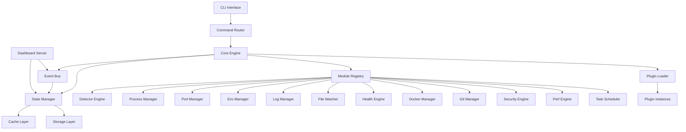
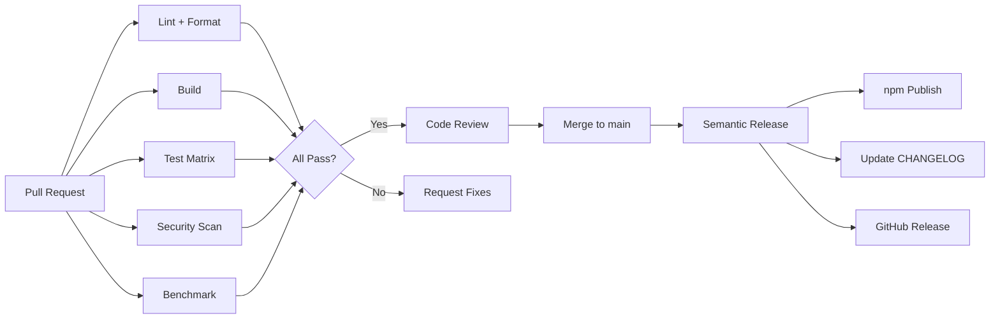

# DevsPilot — The Developer Operating System

> One command. Zero configuration. Everything just works.

```
npx DevsPilot up
```

---

## Table of Contents

1. [Product Vision](#1-product-vision)
2. [Design Philosophy](#2-design-philosophy)
3. [Feature Catalog (140+ Features)](#3-feature-catalog)
4. [Architecture Overview](#4-architecture-overview)
5. [Folder Structure](#5-folder-structure)
6. [Core Module Specifications](#6-core-module-specifications)
7. [Plugin System](#7-plugin-system)
8. [Security Model](#8-security-model)
9. [Performance Strategy](#9-performance-strategy)
10. [CLI Design & UX](#10-cli-design--ux)
11. [Dashboard Specification](#11-dashboard-specification)
12. [Configuration System](#12-configuration-system)
13. [Testing Strategy](#13-testing-strategy)
14. [CI/CD Pipeline](#14-cicd-pipeline)
15. [Documentation Structure](#15-documentation-structure)
16. [Release Strategy](#16-release-strategy)
17. [Open Source Strategy](#17-open-source-strategy)
18. [Scalability Plan](#18-scalability-plan)
19. [Roadmap](#19-roadmap)
20. [Success Metrics](#20-success-metrics)

---

## 1. Product Vision

### 1.1 Problem Statement

Modern developers juggle 10–20 tools daily just to run a local dev environment:

| Pain Point | Current Tools | Time Wasted/Day |
|---|---|---|
| File watching & restart | `nodemon`, `ts-node-dev` | 5–15 min |
| Multi-process orchestration | `concurrently`, `npm-run-all` | 10–20 min |
| Env management | `dotenv`, `dotenv-vault` | 5–10 min |
| Port conflicts | `kill-port`, `fkill` | 5–10 min |
| Service readiness | `wait-on`, manual health checks | 5–15 min |
| Process management | `pm2`, `forever` | 5–10 min |
| Container orchestration | `docker compose` | 10–30 min |
| Log aggregation | Multiple terminal tabs | 10–20 min |
| Dependency health | `npm audit`, `depcheck` | 5–10 min |
| Overall context switching | Between 5+ terminal tabs | 20–40 min |

**Total: 1–3 hours/day wasted on tooling friction.**

DevsPilot eliminates this entirely.

### 1.2 Value Proposition

```
Before DevsPilot:
  Terminal 1: docker compose up -d
  Terminal 2: npm run dev:api
  Terminal 3: npm run dev:web
  Terminal 4: npm run dev:worker
  Terminal 5: tail -f logs/*.log
  Terminal 6: watching for port conflicts
  Manual: checking health of each service
  Manual: monitoring memory leaks
  Manual: restarting crashed processes

After DevsPilot:
  DevsPilot up
```

### 1.3 Target Users

| Persona | Key Need | DevsPilot Value |
|---|---|---|
| **Backend Developer** | Run API + DB + cache + workers | One command, all services orchestrated |
| **Frontend Developer** | Dev server + API mock + hot reload | Auto-detected, zero config |
| **Full Stack Developer** | Frontend + backend + infra | Unified dashboard, single process |
| **DevOps Engineer** | Container orchestration + monitoring | Docker integration, health engine |
| **QA/Test Engineer** | Reproducible environments | Config profiles, environment snapshots |
| **SRE Engineer** | Observability, health checks | Health dashboard, diagnostics |
| **Student** | Learning without tooling friction | Zero config, helpful errors |
| **Freelancer** | Fast project switching | Workspace detection, auto-setup |
| **Startup Team** | Ship fast, debug fast | Everything built-in |
| **Enterprise Developer** | Security, compliance, scale | RBAC, audit logs, plugin governance |

### 1.4 Competitive Positioning

```
                    Simple ─────────────────────── Powerful
                      │                               │
  nodemon ────────────┤                               │
  concurrently ───────┤                               │
  pm2 ────────────────┼───────────────────────────────┤
  docker compose ─────┼───────────────────────────────┤
  nx/turbo ───────────┼───────────────────────────────┤
                      │          ┌─────────────┐      │
                      │          │  DevsPilot    │      │
                      │          │  (here)      │      │
                      │          └─────────────┘      │
                      │                               │
                    Low Config ──────────────── High Config
```

DevsPilot occupies the unique intersection: **maximum power with minimum configuration**.

---

## 2. Design Philosophy

### 2.1 Core Principles

#### Principle 1: Zero Configuration (Convention over Configuration)

```
Rule: If DevsPilot can detect it, it should NOT ask the user.
```

Auto-detection chain:
1. **Language** → `package.json`, `go.mod`, `Cargo.toml`, `requirements.txt`, `pom.xml`
2. **Framework** → Dependencies in manifest (React, Angular, Vue, Nest, Express, Fastify)
3. **Infrastructure** → `docker-compose.yml`, `Dockerfile`, `.env` files
4. **Databases** → Connection strings in env, Docker services, running processes
5. **Monorepo** → `workspaces` in `package.json`, `pnpm-workspace.yaml`, `lerna.json`, `nx.json`, `turbo.json`
6. **Package Manager** → Lock files (`package-lock.json`, `yarn.lock`, `pnpm-lock.yaml`, `bun.lockb`)
7. **Build Tool** → `vite.config.*`, `webpack.config.*`, `rollup.config.*`, `esbuild.*`
8. **Test Framework** → `jest.config.*`, `vitest.config.*`, `.mocharc.*`, `playwright.config.*`
9. **CI/CD** → `.github/`, `.gitlab-ci.yml`, `Jenkinsfile`, `.circleci/`

#### Principle 2: Beautiful but Minimal UI

```
Rule: Every screen must be understandable in under 5 seconds.
```

- No clutter. Every pixel justified.
- Information hierarchy: critical → important → informational → debug.
- Color palette: max 5 semantic colors (success, warning, error, info, muted).
- Typography: monospace for data, sans-serif for labels.
- Dark mode default, light mode available.
- Terminal UI: box-drawing characters, clean alignment, breathing room.
- Dashboard: minimal cards, no charts unless requested, real-time but not noisy.

#### Principle 3: Performance First

```
Rule: DevsPilot must be invisible in resource usage.
```

| Metric | Target | Ceiling |
|---|---|---|
| Cold start | < 500ms | < 1s |
| Warm start | < 200ms | < 500ms |
| Idle RAM | < 50MB | < 100MB |
| Active RAM (10 services) | < 150MB | < 250MB |
| Idle CPU | < 0.5% | < 1% |
| File watcher init (1000 files) | < 100ms | < 300ms |
| Shutdown | < 500ms | < 1s |

#### Principle 4: Safety First

```
Rule: DevsPilot must NEVER cause harm.
```

**Hard Safety Boundaries (cannot be overridden):**
- ❌ Never delete user files
- ❌ Never modify source code
- ❌ Never kill processes it didn't spawn
- ❌ Never change firewall/registry/system settings
- ❌ Never modify Docker state without confirmation
- ❌ Never use `sudo` / elevated privileges automatically
- ❌ Never execute arbitrary shell commands without user opt-in

**Confirmation Required For:**
- ⚠️ Installing missing dependencies
- ⚠️ Starting Docker containers
- ⚠️ Killing port-occupying processes
- ⚠️ Modifying `.env` files
- ⚠️ Running migration scripts
- ⚠️ Installing plugins
- ⚠️ Clearing caches

**Safety Logging:**
- Every destructive action logged to `~/.DevsPilot/audit.log`
- Dry-run mode available for all destructive commands
- Undo capability where feasible

#### Principle 5: Security First

```
Rule: Assume every input is hostile. Assume every plugin is untrusted.
```

Detailed in [Section 8: Security Model](#8-security-model).

### 2.2 Anti-Patterns (Things DevsPilot Must Never Do)

| Anti-Pattern | Why |
|---|---|
| Send telemetry without explicit opt-in | Trust violation |
| Require account creation | Barrier to adoption |
| Phone home on startup | Privacy violation |
| Bundle unnecessary dependencies | Bloat |
| Use `eval()` or `new Function()` | Security risk |
| Shell out to unknown binaries | Command injection risk |
| Store secrets in plain text | Data breach risk |
| Ignore `.gitignore` patterns | Privacy/performance |
| Watch `node_modules` | Performance disaster |
| Poll for file changes | CPU waste |
| Use global mutable state | Race conditions |
| Log full environment variables | Secret leakage |
| Auto-update without consent | Trust violation |

---

## 3. Feature Catalog

### 3.1 Core Features (Always Available)

#### Category A: Project Intelligence (15 features)

| # | Feature | Description | Detection Method |
|---|---|---|---|
| A1 | Project Detection | Identify project type from manifest files | File scanning |
| A2 | Framework Detection | Identify framework from dependencies | Dependency analysis |
| A3 | Language Detection | Identify primary/secondary languages | File extensions + manifests |
| A4 | Package Manager Detection | Detect npm/yarn/pnpm/bun | Lock file detection |
| A5 | Build Tool Detection | Detect Vite/Webpack/esbuild/Rollup/SWC | Config file detection |
| A6 | Monorepo Detection | Detect workspace structure | Workspace config files |
| A7 | Workspace Mapping | Map all packages/services in monorepo | Recursive manifest scan |
| A8 | Dependency Graph | Build dependency tree between workspace packages | Cross-reference analysis |
| A9 | Script Discovery | Find all runnable scripts across workspace | Manifest + Makefile scan |
| A10 | Entry Point Detection | Find main/start scripts automatically | Package.json + conventions |
| A11 | Test Framework Detection | Identify test runner and config | Config file + dependency scan |
| A12 | CI/CD Detection | Detect pipeline configuration | Config file scan |
| A13 | Infrastructure Detection | Detect Docker, K8s, Terraform configs | File pattern matching |
| A14 | Database Detection | Detect DB from env vars, Docker, config | Multi-source analysis |
| A15 | Project Fingerprint | Generate unique project identity hash | Deterministic hashing |

#### Category B: Process Management (18 features)

| # | Feature | Description | Implementation |
|---|---|---|---|
| B1 | Multi-Process Orchestration | Run N services with one command | Child process manager |
| B2 | Dependency-Ordered Startup | Start services in dependency order | Topological sort |
| B3 | Smart Restart | Restart only affected services on change | Dependency graph + file map |
| B4 | Crash Detection | Detect and report process crashes | Exit code monitoring |
| B5 | Auto Restart with Backoff | Restart crashed processes with exponential backoff | Configurable retry logic |
| B6 | Graceful Shutdown | SIGTERM → wait → SIGKILL chain | Configurable timeout |
| B7 | Orphan Process Cleanup | Kill all child processes on exit | Process group tracking |
| B8 | Startup Timing | Measure and display startup duration per service | High-res timers |
| B9 | Shutdown Timing | Measure graceful shutdown duration | High-res timers |
| B10 | Process Health Monitoring | Periodic health checks per process | Configurable probes |
| B11 | Memory Leak Detection | Track RSS growth over time per process | Sampling + trend analysis |
| B12 | CPU Spike Detection | Alert on sustained high CPU | OS-level metrics |
| B13 | Restart History | Log all restarts with reasons and timestamps | Append-only log |
| B14 | Process Grouping | Group related processes (e.g., "backend", "frontend") | Label-based grouping |
| B15 | Selective Restart | Restart specific service or group | CLI command |
| B16 | Process Priority | Define startup priority order | Configuration |
| B17 | Readiness Probes | Wait for service to be ready before starting dependents | HTTP/TCP/file probes |
| B18 | Liveness Probes | Continuous health verification | Configurable intervals |

#### Category C: Port Management (8 features)

| # | Feature | Description | Implementation |
|---|---|---|---|
| C1 | Auto Port Detection | Detect ports from config/env/code | Static analysis + runtime |
| C2 | Port Conflict Detection | Check if port is in use before starting | TCP probe |
| C3 | Port Conflict Resolution | Offer to kill blocking process or use alt port | Interactive prompt |
| C4 | Dynamic Port Assignment | Auto-assign free ports when configured port is taken | OS port allocation |
| C5 | Port Map Display | Show which service is on which port | Live table |
| C6 | Port Forwarding Setup | Coordinate port forwarding for Docker | Docker API |
| C7 | Port Range Reservation | Reserve port ranges per project | Config-based |
| C8 | Open in Browser | Auto-open service URLs after readiness | Configurable |

#### Category D: Environment Management (12 features)

| # | Feature | Description | Implementation |
|---|---|---|---|
| D1 | Env File Discovery | Find all `.env*` files in project | Glob pattern scan |
| D2 | Env File Loading | Load correct env file per environment | Priority chain |
| D3 | Env Validation | Validate required env vars exist | Schema-based |
| D4 | Env Template Generation | Generate `.env.example` from actual env | Redacted export |
| D5 | Missing Env Detection | Detect vars referenced in code but missing | AST + grep analysis |
| D6 | Unused Env Detection | Detect vars defined but never referenced | Cross-reference |
| D7 | Env Conflict Detection | Detect conflicting values across `.env` files | Multi-file comparison |
| D8 | Env Secret Detection | Flag potential secrets in env files | Pattern matching |
| D9 | Env Profile Switching | Switch between dev/staging/prod envs | Profile system |
| D10 | Env Diff | Show differences between env profiles | Diff engine |
| D11 | Env Sync Check | Verify `.env.example` matches `.env` | Schema comparison |
| D12 | Env Encryption | Encrypt sensitive env values at rest | AES-256-GCM |

#### Category E: Log Management (10 features)

| # | Feature | Description | Implementation |
|---|---|---|---|
| E1 | Log Aggregation | Unified log stream from all services | Multiplexed stdout/stderr |
| E2 | Log Coloring | Color-code logs per service | ANSI color assignment |
| E3 | Log Filtering | Filter logs by service, level, or pattern | Real-time filter chain |
| E4 | Log Search | Search across all logs with regex | Streaming search |
| E5 | Log Persistence | Optionally persist logs to disk | Rotating file writer |
| E6 | Log Level Detection | Auto-detect log level from output | Pattern matching |
| E7 | Log Parsing | Parse structured logs (JSON) for display | JSON detection + formatting |
| E8 | Error Highlighting | Highlight errors/warnings distinctly | Pattern + ANSI |
| E9 | Stack Trace Formatting | Pretty-print stack traces with file links | Source map support |
| E10 | Log Export | Export logs in JSON/text format | CLI command |

#### Category F: File Watching (8 features)

| # | Feature | Description | Implementation |
|---|---|---|---|
| F1 | Smart File Watching | Watch only relevant files, ignore noise | `.gitignore` + custom rules |
| F2 | Debounced Restart | Debounce rapid file changes | Configurable debounce |
| F3 | Targeted Restart | Restart only the service affected by changed file | File-to-service mapping |
| F4 | Ignore Pattern Management | Smart default ignore patterns | Convention-based |
| F5 | Watch Stats | Show watched file count and watcher health | Diagnostic info |
| F6 | Watch Mode Toggle | Enable/disable watching per service | Runtime toggle |
| F7 | Custom Watch Actions | Run custom commands on file change | Hook system |
| F8 | Change Detection Method | Use native OS events (inotify/FSEvents/ReadDirectoryChanges) | `fs.watch` / `chokidar` |

#### Category G: Health & Diagnostics (14 features)

| # | Feature | Description | Implementation |
|---|---|---|---|
| G1 | Health Dashboard | Unified health view of all services | Terminal UI |
| G2 | System Resource Monitor | CPU, RAM, disk usage display | OS metrics |
| G3 | Node.js Version Check | Verify Node.js version compatibility | `engines` field |
| G4 | Dependency Doctor | Check for outdated/vulnerable deps | `npm audit` + version check |
| G5 | Circular Dependency Detection | Find circular imports | Module graph analysis |
| G6 | Unused Dependency Detection | Find installed but unused packages | Import analysis |
| G7 | Unused Script Detection | Find defined but unused npm scripts | Cross-reference analysis |
| G8 | Security Vulnerability Scan | Check deps for known CVEs | Advisory database |
| G9 | License Compliance Check | Verify dependency licenses | License field analysis |
| G10 | Disk Usage Analysis | Show project disk footprint | Directory size calculation |
| G11 | Diagnostic Report | Generate comprehensive system report | Multi-source collection |
| G12 | Startup Checklist | Pre-flight checks before starting | Sequential validation |
| G13 | Configuration Validator | Validate DevsPilot config syntax/semantics | Schema validation |
| G14 | Project Score | Rate project health 0–100 | Weighted scoring |

#### Category H: Docker Integration (10 features)

| # | Feature | Description | Implementation |
|---|---|---|---|
| H1 | Docker Detection | Detect if Docker is installed and running | Binary + daemon check |
| H2 | Docker Compose Detection | Find and parse `docker-compose.yml` | File detection |
| H3 | Container Lifecycle | Start/stop/restart containers | Docker API |
| H4 | Container Health | Monitor container health status | Docker health checks |
| H5 | Container Logs | Include container logs in aggregated stream | Docker log API |
| H6 | Container Resource Usage | Show container CPU/RAM | Docker stats API |
| H7 | Volume Management | Display volume info and usage | Docker volume API |
| H8 | Network Detection | Map Docker networks | Docker network API |
| H9 | Image Pull Status | Show image pull progress | Docker events |
| H10 | Docker Cleanup Suggestions | Suggest pruning unused resources | Usage analysis |

#### Category I: Database Integration (8 features)

| # | Feature | Description | Implementation |
|---|---|---|---|
| I1 | Database Detection | Detect databases from env/Docker/config | Multi-source detection |
| I2 | Connection Verification | Test database connectivity | Driver-level ping |
| I3 | Migration Status | Show pending/applied migrations | ORM integration |
| I4 | Seed Status | Show if seed data is applied | ORM integration |
| I5 | Database Size | Show database disk usage | DB query |
| I6 | Active Connection Count | Show current connection pool status | Driver metrics |
| I7 | Slow Query Detection | Alert on queries exceeding threshold | Query monitoring |
| I8 | Schema Drift Detection | Compare schema vs migration state | Schema comparison |

#### Category J: Git Integration (10 features)

| # | Feature | Description | Implementation |
|---|---|---|---|
| J1 | Git Status Display | Show current branch, changes, stash | `git` CLI |
| J2 | Branch Display | Show current branch prominently | `git` CLI |
| J3 | Uncommitted Changes | Count/list uncommitted changes | `git` CLI |
| J4 | Unpushed Commits | Show commits not yet pushed | `git` CLI |
| J5 | Last Commit Info | Show last commit hash, message, author, time | `git` CLI |
| J6 | Branch Age | Show how old the current branch is | `git` CLI |
| J7 | Merge Conflict Detection | Detect unresolved merge conflicts | File scanning |
| J8 | Git Hook Status | Show active git hooks | `.git/hooks` scan |
| J9 | Gitignore Validation | Check for common gitignore mistakes | Pattern analysis |
| J10 | Repository Size | Show `.git` directory size | Directory analysis |

#### Category K: Developer Experience (16 features)

| # | Feature | Description | Implementation |
|---|---|---|---|
| K1 | Interactive CLI | Beautiful, interactive terminal experience | `ink` / custom renderer |
| K2 | Progress Indicators | Show progress for long operations | Spinner + progress bar |
| K3 | Contextual Help | Show help relevant to current state | State-aware help |
| K4 | Error Explanations | Human-readable error messages with fix suggestions | Error catalog |
| K5 | Quick Actions | Keyboard shortcuts for common actions | Key binding system |
| K6 | Command Palette | Fuzzy-search command finder (terminal) | Interactive filter |
| K7 | Notifications | Desktop notifications for critical events | OS notification API |
| K8 | Sound Alerts | Optional audio for events (build done, crash) | Audio playback |
| K9 | Terminal Shortcuts Display | Show available shortcuts | Help overlay |
| K10 | Developer Notes | Attach notes to project (persisted) | Local file storage |
| K11 | Session History | Record and replay sessions | Event log |
| K12 | Workspace Summary | One-screen overview of entire workspace | Aggregated view |
| K13 | Project Templates | Scaffold new projects from templates | Template engine |
| K14 | Configuration Profiles | Save/load/switch configurations | Profile system |
| K15 | JSON/YAML Export | Export any data view as JSON/YAML | Serialization |
| K16 | Clipboard Integration | Copy logs, ports, URLs to clipboard | OS clipboard API |

#### Category L: Performance Monitoring (8 features)

| # | Feature | Description | Implementation |
|---|---|---|---|
| L1 | Startup Performance | Measure and report cold start time | High-res timing |
| L2 | Memory Tracking | Track memory usage per service over time | Periodic sampling |
| L3 | CPU Tracking | Track CPU usage per service over time | Periodic sampling |
| L4 | Event Loop Lag | Monitor Node.js event loop delay | `perf_hooks` |
| L5 | GC Monitoring | Track garbage collection frequency/duration | V8 flags |
| L6 | Handle Tracking | Monitor open handles/requests | `process._getActiveHandles()` |
| L7 | Performance Report | Generate performance summary | Aggregated metrics |
| L8 | Performance Budgets | Alert when metrics exceed thresholds | Configurable limits |

#### Category M: Network & Service Discovery (8 features)

| # | Feature | Description | Implementation |
|---|---|---|---|
| M1 | Service Discovery | Auto-detect running services and ports | Port scanning + config |
| M2 | Service Dependency Map | Visualize inter-service dependencies | Config + detection |
| M3 | API Endpoint Discovery | List detected API routes | Framework-specific parsing |
| M4 | WebSocket Detection | Detect WebSocket servers | Config + port scan |
| M5 | gRPC Detection | Detect gRPC services | Config + proto files |
| M6 | Message Queue Detection | Detect Redis/RabbitMQ/Kafka | Env + Docker |
| M7 | Cache Detection | Detect Redis/Memcached cache layers | Env + Docker |
| M8 | Service URL Map | Show all service URLs in one view | Aggregated display |

#### Category N: Cache & Queue Integration (6 features)

| # | Feature | Description | Implementation |
|---|---|---|---|
| N1 | Redis Detection | Detect Redis from env/Docker | Multi-source |
| N2 | Redis Health | Check Redis connectivity | `PING` command |
| N3 | Queue Detection | Detect job queues (Bull, BullMQ, Agenda) | Dependency analysis |
| N4 | Queue Dashboard Link | Surface existing queue dashboards | URL detection |
| N5 | Background Worker Detection | Detect worker processes | Script analysis |
| N6 | Scheduler Detection | Detect cron/scheduled jobs | Code pattern analysis |

#### Category O: Security Features (10 features)

| # | Feature | Description | Implementation |
|---|---|---|---|
| O1 | Secret Scanner | Detect leaked secrets in code/config | Pattern + entropy analysis |
| O2 | Dependency Audit | Check for known vulnerabilities | Advisory databases |
| O3 | Permission Analysis | Report on file permissions | OS stat calls |
| O4 | HTTPS Certificate Check | Verify local dev certificates | TLS validation |
| O5 | CORS Configuration Check | Detect CORS misconfigurations | Config analysis |
| O6 | Security Headers Check | Verify security headers in dev | HTTP probe |
| O7 | Input Validation Check | Detect missing input validation patterns | Static analysis |
| O8 | Rate Limit Detection | Check for rate limiting configuration | Config analysis |
| O9 | Auth Configuration Check | Verify auth middleware presence | Route analysis |
| O10 | Security Report | Generate comprehensive security report | Aggregated scan |

### 3.2 Feature Count Summary

| Category | Count |
|---|---|
| A. Project Intelligence | 15 |
| B. Process Management | 18 |
| C. Port Management | 8 |
| D. Environment Management | 12 |
| E. Log Management | 10 |
| F. File Watching | 8 |
| G. Health & Diagnostics | 14 |
| H. Docker Integration | 10 |
| I. Database Integration | 8 |
| J. Git Integration | 10 |
| K. Developer Experience | 16 |
| L. Performance Monitoring | 8 |
| M. Network & Service Discovery | 8 |
| N. Cache & Queue Integration | 6 |
| O. Security Features | 10 |
| **Total** | **161** |

> Every feature above solves a real, daily developer pain point. No gimmicks.

---

## 4. Architecture Overview

### 4.1 High-Level Architecture

```
┌─────────────────────────────────────────────────────────────────────┐
│                          CLI Interface                              │
│  ┌──────────┐ ┌──────────┐ ┌──────────┐ ┌──────────┐ ┌──────────┐ │
│  │    up     │ │  doctor  │ │  health  │ │   logs   │ │  status  │ │
│  └────┬─────┘ └────┬─────┘ └────┬─────┘ └────┬─────┘ └────┬─────┘ │
└───────┼────────────┼────────────┼────────────┼────────────┼────────┘
        │            │            │            │            │
┌───────▼────────────▼────────────▼────────────▼────────────▼────────┐
│                         Command Router                              │
└───────┬─────────────────────────────────────────────────────┬──────┘
        │                                                     │
┌───────▼──────────────────────┐  ┌───────────────────────────▼──────┐
│       Core Engine            │  │       Dashboard Server           │
│  ┌────────────────────────┐  │  │  ┌───────────────────────────┐   │
│  │     Event Bus          │  │  │  │   HTTP Server (Fastify)   │   │
│  │   (EventEmitter3)      │  │  │  └─────────┬─────────────────┘   │
│  └────────┬───────────────┘  │  │            │                     │
│           │                  │  │  ┌─────────▼─────────────────┐   │
│  ┌────────▼───────────────┐  │  │  │   WebSocket Server (ws)   │   │
│  │    State Manager       │  │  │  └───────────────────────────┘   │
│  │   (Immutable Store)    │  │  │                                  │
│  └────────┬───────────────┘  │  │  ┌───────────────────────────┐   │
│           │                  │  │  │   Static File Server      │   │
│  ┌────────▼───────────────┐  │  │  │   (Prebuilt SPA)          │   │
│  │    Plugin Loader       │  │  │  └───────────────────────────┘   │
│  │  (Lazy + Sandboxed)    │  │  └──────────────────────────────────┘
│  └────────┬───────────────┘  │
│           │                  │
│  ┌────────▼───────────────┐  │
│  │    Module Registry     │  │
│  └────────────────────────┘  │
└──────────────────────────────┘
        │
┌───────▼──────────────────────────────────────────────────────────┐
│                        Core Modules                               │
│                                                                   │
│  ┌──────────┐ ┌──────────┐ ┌──────────┐ ┌──────────┐            │
│  │ Detector │ │ Process  │ │   Port   │ │   Env    │            │
│  │ Engine   │ │ Manager  │ │ Manager  │ │ Manager  │            │
│  └──────────┘ └──────────┘ └──────────┘ └──────────┘            │
│                                                                   │
│  ┌──────────┐ ┌──────────┐ ┌──────────┐ ┌──────────┐            │
│  │   Log    │ │   File   │ │  Health  │ │  Docker  │            │
│  │ Manager  │ │ Watcher  │ │ Engine   │ │ Manager  │            │
│  └──────────┘ └──────────┘ └──────────┘ └──────────┘            │
│                                                                   │
│  ┌──────────┐ ┌──────────┐ ┌──────────┐ ┌──────────┐            │
│  │   Git    │ │ Security │ │  Perf    │ │   Task   │            │
│  │ Manager  │ │ Engine   │ │ Engine   │ │ Scheduler│            │
│  └──────────┘ └──────────┘ └──────────┘ └──────────┘            │
└───────────────────────────────────────────────────────────────────┘
        │
┌───────▼──────────────────────────────────────────────────────────┐
│                    Infrastructure Layer                            │
│                                                                   │
│  ┌──────────┐ ┌──────────┐ ┌──────────┐ ┌──────────┐            │
│  │  Logger  │ │  Cache   │ │ Storage  │ │  Config  │            │
│  │ (pino)   │ │ (LRU)    │ │ (SQLite) │ │ Loader   │            │
│  └──────────┘ └──────────┘ └──────────┘ └──────────┘            │
└───────────────────────────────────────────────────────────────────┘
```

### 4.2 Module Dependency Graph



### 4.3 Data Flow: `DevsPilot up`

```
User runs: DevsPilot up
     │
     ▼
1. CLI parses command + flags
     │
     ▼
2. Config Loader
   ├─ Load DevsPilot.config.* (if exists)
   ├─ Merge CLI flags
   └─ Apply defaults
     │
     ▼
3. Detector Engine (parallel)
   ├─ Project type
   ├─ Framework
   ├─ Package manager
   ├─ Build tool
   ├─ Monorepo structure
   ├─ Docker setup
   ├─ Database
   ├─ Environment files
   └─ Git state
     │
     ▼
4. Startup Checklist
   ├─ Node.js version OK?
   ├─ Dependencies installed?
   ├─ Env vars present?
   ├─ Ports available?
   ├─ Docker running? (if needed)
   ├─ Database reachable? (if needed)
   └─ Config valid?
     │
     ▼
5. Plugin Resolution
   ├─ Match detected tech → plugins
   ├─ Lazy-load required plugins
   └─ Initialize plugin lifecycle
     │
     ▼
6. Process Orchestration
   ├─ Build dependency graph
   ├─ Start services in topological order
   ├─ Wait for readiness probes
   └─ Report startup timing
     │
     ▼
7. Runtime Loop
   ├─ File watcher active
   ├─ Health checks running
   ├─ Log aggregation streaming
   ├─ Dashboard available (if requested)
   └─ Event bus processing
     │
     ▼
8. Awaiting shutdown signal (SIGINT/SIGTERM)
   ├─ Graceful shutdown sequence
   ├─ Process cleanup
   ├─ Orphan cleanup
   └─ Report shutdown timing
```

### 4.4 Communication Patterns

| Pattern | Technology | Use Case |
|---|---|---|
| Intra-module | Event Bus (EventEmitter3) | Module-to-module communication |
| CLI ↔ Engine | Direct function calls | Synchronous commands |
| Engine ↔ Dashboard | WebSocket | Real-time state sync |
| Engine ↔ Plugins | Message passing (structured) | Plugin isolation |
| File system | `fs.watch` / chokidar | File change detection |
| Docker | Docker Engine API (HTTP) | Container management |
| Child processes | `child_process.spawn` | Service management |

---

## 5. Folder Structure

### 5.1 Repository Root

```
DevsPilot/
├── .github/
│   ├── ISSUE_TEMPLATE/
│   │   ├── bug_report.yml
│   │   ├── feature_request.yml
│   │   ├── plugin_request.yml
│   │   └── config.yml
│   ├── PULL_REQUEST_TEMPLATE.md
│   ├── CODEOWNERS
│   ├── FUNDING.yml
│   ├── dependabot.yml
│   ├── SECURITY.md
│   └── workflows/
│       ├── ci.yml
│       ├── release.yml
│       ├── security.yml
│       ├── benchmark.yml
│       └── plugin-ci.yml
│
├── packages/
│   ├── core/                    # @devspilot/core
│   ├── cli/                     # @devspilot/cli (the `DevsPilot` command)
│   ├── dashboard/               # @DevsPilot/dashboard (web UI)
│   ├── shared/                  # @devspilot/shared (types, utils, constants)
│   │
│   ├── plugins/
│   │   ├── plugin-react/        # @devspilot/plugin-react
│   │   ├── plugin-vue/          # @devspilot/plugin-vue
│   │   ├── plugin-angular/      # @devspilot/plugin-angular
│   │   ├── plugin-svelte/       # @devspilot/plugin-svelte
│   │   ├── plugin-next/         # @devspilot/plugin-next
│   │   ├── plugin-nuxt/         # @devspilot/plugin-nuxt
│   │   ├── plugin-nest/         # @devspilot/plugin-nest
│   │   ├── plugin-express/      # @devspilot/plugin-express
│   │   ├── plugin-fastify/      # @devspilot/plugin-fastify
│   │   ├── plugin-docker/       # @devspilot/plugin-docker
│   │   ├── plugin-postgres/     # @devspilot/plugin-postgres
│   │   ├── plugin-mongodb/      # @devspilot/plugin-mongodb
│   │   ├── plugin-mysql/        # @devspilot/plugin-mysql
│   │   ├── plugin-redis/        # @devspilot/plugin-redis
│   │   ├── plugin-prisma/       # @devspilot/plugin-prisma
│   │   ├── plugin-drizzle/      # @devspilot/plugin-drizzle
│   │   ├── plugin-typeorm/      # @devspilot/plugin-typeorm
│   │   ├── plugin-aws/          # @devspilot/plugin-aws
│   │   ├── plugin-azure/        # @devspilot/plugin-azure
│   │   ├── plugin-gcp/          # @devspilot/plugin-gcp
│   │   ├── plugin-firebase/     # @devspilot/plugin-firebase
│   │   ├── plugin-supabase/     # @devspilot/plugin-supabase
│   │   ├── plugin-testing/      # @devspilot/plugin-testing
│   │   ├── plugin-graphql/      # @devspilot/plugin-graphql
│   │   ├── plugin-trpc/         # @devspilot/plugin-trpc
│   │   └── plugin-kubernetes/   # @devspilot/plugin-kubernetes
│   │
│   └── create-DevsPilot/         # npx create-DevsPilot (project scaffolding)
│
├── docs/
│   ├── getting-started/
│   │   ├── installation.md
│   │   ├── quick-start.md
│   │   └── first-project.md
│   ├── guides/
│   │   ├── configuration.md
│   │   ├── plugins.md
│   │   ├── monorepos.md
│   │   ├── docker.md
│   │   ├── security.md
│   │   ├── performance.md
│   │   ├── troubleshooting.md
│   │   └── migration.md
│   ├── reference/
│   │   ├── cli.md
│   │   ├── config.md
│   │   ├── api.md
│   │   ├── events.md
│   │   └── plugin-api.md
│   ├── architecture/
│   │   ├── overview.md
│   │   ├── core.md
│   │   ├── plugins.md
│   │   └── security.md
│   └── contributing/
│       ├── setup.md
│       ├── guidelines.md
│       ├── plugin-development.md
│       └── release-process.md
│
├── examples/
│   ├── basic-node/
│   ├── express-api/
│   ├── react-vite/
│   ├── next-app/
│   ├── nest-api/
│   ├── fullstack-monorepo/
│   ├── docker-compose/
│   ├── microservices/
│   └── custom-plugin/
│
├── benchmarks/
│   ├── startup/
│   ├── memory/
│   ├── cpu/
│   └── scale/
│
├── scripts/
│   ├── setup.sh
│   ├── release.sh
│   ├── benchmark.sh
│   └── validate-plugins.sh
│
├── .husky/
│   ├── pre-commit
│   └── commit-msg
│
├── package.json               # Root workspace
├── pnpm-workspace.yaml
├── tsconfig.base.json
├── tsconfig.build.json
├── .eslintrc.cjs
├── .prettierrc
├── vitest.config.ts
├── turbo.json
├── LICENSE                    # Apache-2.0
├── README.md
├── CHANGELOG.md
├── CODE_OF_CONDUCT.md
├── CONTRIBUTING.md
├── SECURITY.md
└── ROADMAP.md
```

### 5.2 Core Package Structure

```
packages/core/
├── src/
│   ├── index.ts                    # Public API exports
│   │
│   ├── engine/
│   │   ├── DevsPilotEngine.ts       # Main orchestrator
│   │   ├── ModuleRegistry.ts       # Module lifecycle management
│   │   ├── LifecycleManager.ts     # Startup/shutdown coordination
│   │   └── index.ts
│   │
│   ├── bus/
│   │   ├── EventBus.ts             # Typed event bus
│   │   ├── events.ts               # Event type definitions
│   │   └── index.ts
│   │
│   ├── state/
│   │   ├── StateManager.ts         # Immutable state store
│   │   ├── StateSchema.ts          # State shape definitions
│   │   ├── selectors.ts            # State selectors
│   │   └── index.ts
│   │
│   ├── config/
│   │   ├── ConfigLoader.ts         # Config file discovery + loading
│   │   ├── ConfigSchema.ts         # Zod schema for validation
│   │   ├── ConfigMerger.ts         # Merge configs with precedence
│   │   ├── defaults.ts             # Default configuration values
│   │   └── index.ts
│   │
│   ├── detector/
│   │   ├── DetectorEngine.ts       # Orchestrate all detectors
│   │   ├── detectors/
│   │   │   ├── ProjectDetector.ts
│   │   │   ├── FrameworkDetector.ts
│   │   │   ├── PackageManagerDetector.ts
│   │   │   ├── BuildToolDetector.ts
│   │   │   ├── MonorepoDetector.ts
│   │   │   ├── DockerDetector.ts
│   │   │   ├── DatabaseDetector.ts
│   │   │   ├── TestFrameworkDetector.ts
│   │   │   ├── CIDetector.ts
│   │   │   └── index.ts
│   │   └── index.ts
│   │
│   ├── process/
│   │   ├── ProcessManager.ts       # Process lifecycle
│   │   ├── ProcessPool.ts          # Process pool management
│   │   ├── ProcessMonitor.ts       # Health + metrics per process
│   │   ├── GracefulShutdown.ts     # Shutdown orchestration
│   │   ├── OrphanCleaner.ts        # Orphan process cleanup
│   │   └── index.ts
│   │
│   ├── port/
│   │   ├── PortManager.ts          # Port allocation + conflict resolution
│   │   ├── PortScanner.ts          # Port availability checking
│   │   └── index.ts
│   │
│   ├── env/
│   │   ├── EnvManager.ts           # Env file management
│   │   ├── EnvValidator.ts         # Required var validation
│   │   ├── EnvAnalyzer.ts          # Unused/missing var detection
│   │   ├── EnvEncryptor.ts         # Env value encryption
│   │   └── index.ts
│   │
│   ├── log/
│   │   ├── LogManager.ts           # Log aggregation + routing
│   │   ├── LogFormatter.ts         # Output formatting
│   │   ├── LogFilter.ts            # Level/service filtering
│   │   ├── LogPersister.ts         # Disk persistence
│   │   └── index.ts
│   │
│   ├── watcher/
│   │   ├── FileWatcher.ts          # File system watching
│   │   ├── WatcherConfig.ts        # Ignore patterns + rules
│   │   ├── ChangeDebouncer.ts      # Debounce logic
│   │   └── index.ts
│   │
│   ├── health/
│   │   ├── HealthEngine.ts         # Health check orchestration
│   │   ├── probes/
│   │   │   ├── HttpProbe.ts
│   │   │   ├── TcpProbe.ts
│   │   │   ├── ProcessProbe.ts
│   │   │   ├── FileProbe.ts
│   │   │   └── index.ts
│   │   ├── HealthAggregator.ts     # Aggregate health status
│   │   └── index.ts
│   │
│   ├── docker/
│   │   ├── DockerManager.ts        # Docker orchestration
│   │   ├── DockerClient.ts         # Docker API client
│   │   ├── ComposeParser.ts        # docker-compose.yml parser
│   │   └── index.ts
│   │
│   ├── git/
│   │   ├── GitManager.ts           # Git operations
│   │   ├── GitParser.ts            # Git output parsing
│   │   └── index.ts
│   │
│   ├── security/
│   │   ├── SecurityEngine.ts       # Security check orchestration
│   │   ├── SecretScanner.ts        # Secret detection
│   │   ├── DependencyAuditor.ts    # Vulnerability scanning
│   │   ├── InputSanitizer.ts       # Input validation
│   │   ├── PathValidator.ts        # Path traversal prevention
│   │   └── index.ts
│   │
│   ├── performance/
│   │   ├── PerfEngine.ts           # Performance monitoring
│   │   ├── MemoryTracker.ts        # Memory usage tracking
│   │   ├── CpuTracker.ts           # CPU usage tracking
│   │   ├── StartupTimer.ts         # Startup timing
│   │   └── index.ts
│   │
│   ├── diagnostics/
│   │   ├── DiagnosticsEngine.ts    # Diagnostic report generation
│   │   ├── DependencyDoctor.ts     # Dependency health checks
│   │   ├── ProjectScorer.ts        # Project health scoring
│   │   └── index.ts
│   │
│   ├── plugin/
│   │   ├── PluginLoader.ts         # Plugin discovery + loading
│   │   ├── PluginSandbox.ts        # Plugin isolation
│   │   ├── PluginPermissions.ts    # Permission system
│   │   ├── PluginLifecycle.ts      # Lifecycle hook management
│   │   ├── PluginValidator.ts      # Plugin manifest validation
│   │   ├── PluginRegistry.ts       # Installed plugin registry
│   │   └── index.ts
│   │
│   ├── storage/
│   │   ├── StorageManager.ts       # Persistent storage
│   │   ├── CacheManager.ts         # In-memory LRU cache
│   │   ├── ProjectStore.ts         # Per-project storage
│   │   └── index.ts
│   │
│   ├── scheduler/
│   │   ├── TaskScheduler.ts        # Scheduled task runner
│   │   ├── CronParser.ts           # Cron expression parser
│   │   └── index.ts
│   │
│   └── utils/
│       ├── logger.ts               # pino logger factory
│       ├── errors.ts               # Custom error classes
│       ├── validation.ts           # Zod schemas
│       ├── platform.ts             # OS-specific utilities
│       ├── hash.ts                 # Hashing utilities
│       ├── retry.ts                # Retry with backoff
│       ├── debounce.ts             # Debounce utility
│       ├── semver.ts               # Version comparison
│       └── index.ts
│
├── package.json
├── tsconfig.json
├── tsconfig.build.json
├── vitest.config.ts
└── README.md
```

### 5.3 CLI Package Structure

```
packages/cli/
├── src/
│   ├── index.ts                    # CLI entry point
│   ├── bin.ts                      # Binary entry (#!/usr/bin/env node)
│   │
│   ├── commands/
│   │   ├── up.ts                   # DevsPilot up
│   │   ├── down.ts                 # DevsPilot down
│   │   ├── restart.ts              # DevsPilot restart
│   │   ├── status.ts               # DevsPilot status
│   │   ├── logs.ts                 # DevsPilot logs
│   │   ├── health.ts               # DevsPilot health
│   │   ├── doctor.ts               # DevsPilot doctor
│   │   ├── dashboard.ts            # DevsPilot dashboard
│   │   ├── config.ts               # DevsPilot config
│   │   ├── plugins.ts              # DevsPilot plugins
│   │   ├── env.ts                  # DevsPilot env
│   │   ├── ports.ts                # DevsPilot ports
│   │   ├── security.ts             # DevsPilot security
│   │   ├── perf.ts                 # DevsPilot perf
│   │   ├── report.ts              # DevsPilot report
│   │   ├── init.ts                 # DevsPilot init
│   │   ├── update.ts               # DevsPilot update
│   │   ├── version.ts              # DevsPilot version
│   │   ├── help.ts                 # DevsPilot help
│   │   └── index.ts                # Command registry
│   │
│   ├── ui/
│   │   ├── renderer.ts             # Terminal UI renderer
│   │   ├── components/
│   │   │   ├── Table.ts
│   │   │   ├── Box.ts
│   │   │   ├── StatusLine.ts
│   │   │   ├── ProgressBar.ts
│   │   │   ├── Spinner.ts
│   │   │   ├── Banner.ts
│   │   │   ├── Prompt.ts
│   │   │   └── index.ts
│   │   ├── themes/
│   │   │   ├── dark.ts
│   │   │   ├── light.ts
│   │   │   └── index.ts
│   │   └── colors.ts               # Color palette
│   │
│   ├── formatters/
│   │   ├── logFormatter.ts
│   │   ├── statusFormatter.ts
│   │   ├── healthFormatter.ts
│   │   ├── doctorFormatter.ts
│   │   └── index.ts
│   │
│   └── utils/
│       ├── args.ts                  # Argument parsing
│       ├── interactive.ts           # Interactive prompts
│       ├── clipboard.ts             # Clipboard integration
│       ├── notifications.ts         # Desktop notifications
│       └── index.ts
│
├── package.json
├── tsconfig.json
└── README.md
```

### 5.4 Dashboard Package Structure

```
packages/dashboard/
├── src/
│   ├── server/
│   │   ├── DashboardServer.ts       # HTTP + WS server
│   │   ├── routes/
│   │   │   ├── api.ts               # REST API routes
│   │   │   ├── ws.ts                # WebSocket handlers
│   │   │   └── static.ts            # Static file serving
│   │   └── middleware/
│   │       ├── auth.ts              # Token auth (optional)
│   │       ├── cors.ts              # CORS configuration
│   │       └── security.ts          # Security headers
│   │
│   ├── client/                      # Prebuilt SPA (vanilla JS)
│   │   ├── index.html
│   │   ├── css/
│   │   │   ├── reset.css
│   │   │   ├── variables.css
│   │   │   ├── layout.css
│   │   │   ├── components.css
│   │   │   └── themes/
│   │   │       ├── dark.css
│   │   │       └── light.css
│   │   ├── js/
│   │   │   ├── app.js
│   │   │   ├── websocket.js
│   │   │   ├── state.js
│   │   │   ├── router.js
│   │   │   └── components/
│   │   │       ├── ServiceList.js
│   │   │       ├── LogViewer.js
│   │   │       ├── HealthPanel.js
│   │   │       ├── PortMap.js
│   │   │       ├── EnvPanel.js
│   │   │       ├── PerfPanel.js
│   │   │       └── SystemInfo.js
│   │   └── assets/
│   │       ├── favicon.svg
│   │       └── logo.svg
│   │
│   └── index.ts
│
├── package.json
├── tsconfig.json
└── README.md
```

### 5.5 Plugin Package Structure (Template)

```
packages/plugins/plugin-{name}/
├── src/
│   ├── index.ts                     # Plugin entry + manifest
│   ├── detector.ts                  # Framework/tool detection logic
│   ├── provider.ts                  # Feature provider
│   ├── health.ts                    # Health check implementations
│   ├── commands.ts                  # Plugin-contributed CLI commands
│   └── types.ts                     # Plugin-specific types
│
├── package.json
├── tsconfig.json
├── vitest.config.ts
├── README.md
└── PERMISSIONS.md                   # Required permissions declaration
```

---

## 6. Core Module Specifications

### 6.1 Event Bus

```
Module: EventBus
Library: eventemitter3 (or custom typed implementation)
Pattern: Publish/Subscribe with typed events
```

**Design Requirements:**
- All events are strongly typed (TypeScript discriminated unions)
- Events are immutable (frozen objects)
- Supports wildcard listeners for debugging
- Supports event history (last N events) for late subscribers
- Max listener warnings configurable
- Memory-safe: auto-unsubscribe on module teardown
- No circular event chains (cycle detection in development mode)

**Core Event Categories:**

| Category | Example Events |
|---|---|
| `engine:*` | `engine:starting`, `engine:ready`, `engine:stopping`, `engine:error` |
| `process:*` | `process:started`, `process:crashed`, `process:restarted`, `process:output` |
| `port:*` | `port:allocated`, `port:conflict`, `port:released` |
| `env:*` | `env:loaded`, `env:missing`, `env:conflict` |
| `file:*` | `file:changed`, `file:added`, `file:removed` |
| `health:*` | `health:check`, `health:degraded`, `health:recovered` |
| `docker:*` | `docker:started`, `docker:stopped`, `docker:healthy` |
| `plugin:*` | `plugin:loaded`, `plugin:error`, `plugin:unloaded` |
| `security:*` | `security:warning`, `security:vulnerability` |
| `perf:*` | `perf:threshold`, `perf:report` |

### 6.2 State Manager

```
Module: StateManager
Pattern: Single source of truth, immutable updates
```

**Design Requirements:**
- Single immutable state tree
- State updates via pure reducer functions
- Subscribers notified on relevant state slice changes only
- State serializable to JSON for dashboard sync
- State diff calculation for efficient WebSocket updates
- Snapshot/restore capability for debugging

**State Shape (top-level):**

```
DevsPilotState {
  engine: EngineState           // overall status, version, uptime
  config: ResolvedConfig        // merged configuration
  project: ProjectState         // detected project info
  services: ServiceState[]      // running processes/services
  ports: PortState[]            // allocated ports
  env: EnvState                 // environment status
  health: HealthState           // aggregate health
  docker: DockerState           // container status
  git: GitState                 // repository status
  performance: PerfState        // performance metrics
  plugins: PluginState[]        // loaded plugins
  diagnostics: DiagnosticState  // diagnostic results
}
```

### 6.3 Process Manager

```
Module: ProcessManager
Dependencies: EventBus, StateManager, PortManager, HealthEngine
```

**Design Requirements:**
- Spawn child processes via `child_process.spawn` (never `exec`)
- Process group tracking via `detached: false` + manual PID tracking
- Graceful shutdown: SIGTERM → configurable timeout → SIGKILL
- Orphan cleanup on unexpected exit via `process.on('exit')` + PID file
- Restart with exponential backoff: 1s → 2s → 4s → 8s → max 30s
- Max restart count configurable (default: 10 in 60 seconds, then stop)
- stdout/stderr capture without buffering (pipe mode)
- Process metadata: start time, restart count, last exit code, CPU/RSS

**Process Lifecycle:**

```
PENDING → STARTING → RUNNING → (CRASHED → RESTARTING)* → STOPPING → STOPPED
                                     │
                                     └─→ FAILED (max restarts exceeded)
```

### 6.4 Detector Engine

```
Module: DetectorEngine
Dependencies: none (pure functions, file system reads only)
```

**Design Requirements:**
- All detectors are independent and parallel-executable
- Each detector returns a confidence score (0–1)
- Results cached per project fingerprint
- New detectors pluggable via plugin system
- Detection completes in < 200ms for typical projects

**Detection Algorithm:**

```
1. Scan project root for manifest files (parallel I/O)
2. For each detected manifest:
   a. Parse to extract metadata
   b. Run framework matchers against dependencies
   c. Score each match by confidence
3. Merge results, highest confidence wins conflicts
4. Cache results with file modification timestamps
5. Emit detection results to Event Bus
```

### 6.5 Health Engine

```
Module: HealthEngine
Dependencies: EventBus, StateManager, ProcessManager
```

**Health Check Types:**

| Probe Type | Mechanism | Use Case |
|---|---|---|
| HTTP | `GET /health` → 2xx | Web servers, APIs |
| TCP | Socket connect | Databases, caches |
| Process | PID exists + responsive | Any spawned process |
| File | File exists + writable | File-based services |
| Custom | Plugin-provided function | Anything else |

**Health Status Model:**

```
UNKNOWN → STARTING → HEALTHY → DEGRADED → UNHEALTHY → DEAD
                        ↑           │          │
                        └───────────┴──────────┘ (recovery)
```

**Configuration:**
- `interval`: Check frequency (default: 10s)
- `timeout`: Probe timeout (default: 5s)
- `retries`: Failures before marking unhealthy (default: 3)
- `startPeriod`: Grace period after start (default: 30s)

### 6.6 File Watcher

```
Module: FileWatcher
Library: chokidar (with fallback to native fs.watch)
Dependencies: EventBus, ProcessManager
```

**Design Requirements:**
- Use native OS events (inotify/FSEvents/ReadDirectoryChanges), never polling
- Auto-derive ignore patterns from `.gitignore`, `.dockerignore`
- Always ignore: `node_modules`, `.git`, `dist`, `build`, `.next`, `coverage`, `*.log`
- Configurable additional ignore patterns
- Debounce: default 300ms, configurable per service
- File-to-service mapping for targeted restarts
- Watch count monitoring (warn if > 10,000 handles)
- Graceful degradation: if OS watcher limit hit, fall back to polling with warning

### 6.7 Log Manager

```
Module: LogManager
Dependencies: EventBus, StateManager
```

**Design:**
- Each service assigned a unique color from a curated palette (max 16 colors, then cycle)
- Log prefix format: `[SERVICE_NAME]` left-padded to longest service name
- Structured log detection: auto-parse JSON log lines
- Log level detection via regex patterns (`error`, `warn`, `info`, `debug`, `trace`)
- Error highlighting: red background for errors, yellow for warnings
- Stack trace grouping: collapse multi-line stack traces
- Log buffer: last 1000 lines per service in memory (configurable)
- Log persistence: optional file output with rotation (10MB default, 5 files)
- Secret redaction: mask patterns matching known secret formats

**Log Output Format:**

```
┌─ Service Name ───────────── Level ─── Timestamp ──────────────────┐
│ [api]           info    12:34:56  Server listening on port 3000    │
│ [web]           ready   12:34:57  Development server started       │
│ [worker]        info    12:34:58  Processing queue connected       │
│ [api]           error   12:35:01  TypeError: Cannot read prop...   │
│                                   at UserService.findById (...)    │
│                                   at Router.handle (...)           │
│ [db]            info    12:35:02  Connection pool: 5/10 active     │
└────────────────────────────────────────────────────────────────────┘
```

### 6.8 Configuration System

**Config File Discovery Order (first found wins):**

```
1. DevsPilot.config.ts
2. DevsPilot.config.js
3. DevsPilot.config.mjs
4. DevsPilot.config.json
5. DevsPilot.config.yaml
6. DevsPilot.config.yml
7. "DevsPilot" key in package.json
```

**Configuration Merge Precedence (highest → lowest):**

```
CLI flags → Environment variables → Config file → Plugin defaults → Built-in defaults
```

**Minimal Config Example:**

```yaml
# DevsPilot.config.yml — most projects need ZERO config
# Only specify what you want to override

services:
  api:
    command: npm run dev:api
    port: 3000
    health: /health
  web:
    command: npm run dev
    port: 5173
    dependsOn: [api]
```

**Full Config Schema (all optional):**

```yaml
# DevsPilot.config.yml — full reference

# Project metadata (auto-detected if not specified)
name: my-project
type: monorepo

# Service definitions
services:
  <name>:
    command: string              # Command to run
    cwd: string                  # Working directory (relative)
    port: number                 # Expected port
    env: Record<string, string>  # Additional env vars
    envFile: string | string[]   # Env file(s) to load
    dependsOn: string[]          # Services to start first
    health:
      path: string              # HTTP health endpoint
      port: number              # Health check port (if different)
      interval: number          # Check interval (ms)
      timeout: number           # Check timeout (ms)
      retries: number           # Retries before unhealthy
      startPeriod: number       # Grace period (ms)
    watch:
      enabled: boolean          # Enable file watching (default: true)
      paths: string[]           # Paths to watch
      ignore: string[]          # Additional ignore patterns
      debounce: number          # Debounce delay (ms)
    restart:
      enabled: boolean          # Auto-restart on crash (default: true)
      maxRetries: number        # Max restarts (default: 10)
      backoff: number           # Initial backoff (ms, default: 1000)
      maxBackoff: number        # Max backoff (ms, default: 30000)
    group: string               # Service group name
    priority: number            # Startup priority (lower = first)

# Docker configuration
docker:
  enabled: boolean              # Enable Docker integration
  composeFile: string           # docker-compose file path
  services: string[]            # Specific services to manage
  autoStart: boolean            # Start containers automatically

# Environment configuration
env:
  files: string[]               # Env files to load
  required: string[]            # Required env vars
  validate: boolean             # Enable validation (default: true)

# Log configuration
logs:
  level: string                 # Minimum log level
  persist: boolean              # Persist logs to disk
  maxSize: string               # Max log file size (e.g., "10MB")
  maxFiles: number              # Max rotated files
  redact: string[]              # Patterns to redact from logs

# Dashboard configuration
dashboard:
  enabled: boolean              # Enable dashboard (default: false)
  port: number                  # Dashboard port (default: 9900)
  open: boolean                 # Auto-open in browser

# Watch configuration (global)
watch:
  ignore: string[]              # Global ignore patterns
  debounce: number              # Global debounce (ms)

# Plugin configuration
plugins:
  <pluginName>:
    enabled: boolean
    # ... plugin-specific config

# Performance thresholds
performance:
  maxMemory: string             # e.g., "512MB"
  maxCpu: number                # e.g., 80 (percent)
  alerts: boolean               # Enable performance alerts

# Profiles
profiles:
  <profileName>:
    # Any config overrides for this profile
    # Use: DevsPilot up --profile <profileName>
```

---

## 7. Plugin System

### 7.1 Plugin Architecture

```
┌─────────────────────────────────────────────────────┐
│                  Plugin Host (Core)                   │
│                                                       │
│  ┌──────────────────────────────────────────────┐    │
│  │            Plugin Loader                      │    │
│  │  1. Discover plugins (node_modules scan)      │    │
│  │  2. Validate manifest                         │    │
│  │  3. Check permissions                         │    │
│  │  4. Load in sandbox                           │    │
│  └──────────┬───────────────────────────────────┘    │
│             │                                         │
│  ┌──────────▼───────────────────────────────────┐    │
│  │           Plugin Sandbox                      │    │
│  │  ┌─────────────────────────────────────────┐  │    │
│  │  │ Restricted API Surface:                 │  │    │
│  │  │   ✓ Event Bus (subscribe/emit)          │  │    │
│  │  │   ✓ State (read-only + own namespace)   │  │    │
│  │  │   ✓ Config (own namespace)              │  │    │
│  │  │   ✓ Logger (prefixed)                   │  │    │
│  │  │   ✓ Health (register probes)            │  │    │
│  │  │   ✓ CLI (register commands)             │  │    │
│  │  │   ✓ Dashboard (register panels)         │  │    │
│  │  │   ✗ File system (no direct access)      │  │    │
│  │  │   ✗ Network (no direct access)          │  │    │
│  │  │   ✗ Process (no direct spawn)           │  │    │
│  │  │   ✗ Child processes (no direct access)  │  │    │
│  │  └─────────────────────────────────────────┘  │    │
│  └───────────────────────────────────────────────┘    │
│             │                                         │
│  ┌──────────▼───────────────────────────────────┐    │
│  │           Plugin Registry                     │    │
│  │  Tracks: loaded, version, permissions, health │    │
│  └───────────────────────────────────────────────┘    │
└─────────────────────────────────────────────────────┘
```

### 7.2 Plugin Manifest

Every plugin must export a manifest object:

```typescript
interface DevsPilotPlugin {
  // Required
  name: string;                              // e.g., "@devspilot/plugin-react"
  version: string;                           // semver
  description: string;                       // Human-readable description
  
  // Detection
  detect?: (context: DetectionContext) => DetectionResult | null;
  
  // Permissions (declared, user-approved)
  permissions: PluginPermission[];
  
  // Lifecycle Hooks
  onRegister?: (api: PluginAPI) => void | Promise<void>;
  onActivate?: (api: PluginAPI) => void | Promise<void>;
  onDeactivate?: (api: PluginAPI) => void | Promise<void>;
  
  // Feature Providers
  healthChecks?: HealthCheckProvider[];
  commands?: CommandProvider[];
  dashboardPanels?: PanelProvider[];
  detectors?: DetectorProvider[];
  
  // Compatibility
  engines: {
    DevsPilot: string;                        // semver range
    node?: string;                           // semver range
  };
  
  // Dependencies on other plugins
  dependencies?: string[];
}
```

### 7.3 Plugin Permissions

```typescript
type PluginPermission =
  | { type: 'event'; pattern: string }         // Subscribe to events matching pattern
  | { type: 'state'; namespace: string }       // Read state from namespace
  | { type: 'config'; namespace: string }      // Access config namespace
  | { type: 'command'; name: string }          // Register CLI command
  | { type: 'dashboard'; panel: string }       // Register dashboard panel
  | { type: 'health'; probe: string }          // Register health probe
  | { type: 'fs'; path: string; mode: 'read' | 'write' }  // File system access
  | { type: 'network'; host: string; port?: number }       // Network access
  | { type: 'process'; command: string }       // Spawn specific process
```

**Permission Approval Flow:**

```
Plugin installed → Manifest parsed → Permissions extracted
    → First run: User prompted to approve each permission
    → Approved permissions cached in ~/.DevsPilot/plugin-permissions.json
    → Subsequent runs: Auto-approved if permissions unchanged
    → Permission change: Re-prompt user
```

### 7.4 Plugin Lifecycle

```
DISCOVERED → VALIDATED → REGISTERED → ACTIVATED → RUNNING
                                                      │
                                          DEACTIVATING ← (shutdown)
                                                      │
                                                  STOPPED
```

**Lifecycle Hooks Execution Order (on `DevsPilot up`):**

```
1. All plugins: onRegister()     — Register capabilities
2. Detection phase runs          — Each plugin's detect() called
3. Relevant plugins: onActivate() — Only plugins matching detected tech
4. Runtime...
5. All active plugins: onDeactivate() — Graceful cleanup
```

### 7.5 Plugin API Surface

```typescript
interface PluginAPI {
  // Event Bus (scoped)
  events: {
    on(event: string, handler: Function): void;
    emit(event: string, data: unknown): void;
    off(event: string, handler: Function): void;
  };
  
  // State (read-only + own namespace)
  state: {
    get<T>(selector: string): T;
    subscribe(selector: string, handler: (value: unknown) => void): void;
    setOwn(key: string, value: unknown): void;  // Own namespace only
  };
  
  // Config (own namespace)
  config: {
    get<T>(key: string, defaultValue?: T): T;
  };
  
  // Logger (prefixed with plugin name)
  logger: {
    info(message: string, ...args: unknown[]): void;
    warn(message: string, ...args: unknown[]): void;
    error(message: string, ...args: unknown[]): void;
    debug(message: string, ...args: unknown[]): void;
  };
  
  // Health (register probes)
  health: {
    register(probe: HealthProbe): void;
    report(status: HealthStatus): void;
  };
  
  // CLI (register commands)
  cli: {
    register(command: CommandDefinition): void;
  };
  
  // Dashboard (register panels)
  dashboard: {
    register(panel: PanelDefinition): void;
  };
  
  // Storage (scoped to plugin)
  storage: {
    get<T>(key: string): Promise<T | null>;
    set(key: string, value: unknown): Promise<void>;
    delete(key: string): Promise<void>;
  };
  
  // Context
  context: {
    projectRoot: string;
    projectType: string;
    framework: string;
    packageManager: string;
  };
}
```

### 7.6 Official Plugin Registry

| Plugin | Trigger | Features |
|---|---|---|
| `@devspilot/plugin-react` | `react` in deps | CRA/Vite detection, dev server health, component count |
| `@devspilot/plugin-vue` | `vue` in deps | Vue CLI/Vite detection, devtools |
| `@devspilot/plugin-angular` | `@angular/core` in deps | Angular CLI detection, build tracking |
| `@devspilot/plugin-svelte` | `svelte` in deps | SvelteKit detection, adapter info |
| `@devspilot/plugin-next` | `next` in deps | Next.js specific health, route detection |
| `@devspilot/plugin-nuxt` | `nuxt` in deps | Nuxt modules, nitro detection |
| `@devspilot/plugin-nest` | `@nestjs/core` in deps | Module detection, Swagger, microservices |
| `@devspilot/plugin-express` | `express` in deps | Route listing, middleware stack |
| `@devspilot/plugin-fastify` | `fastify` in deps | Plugin tree, route listing |
| `@devspilot/plugin-docker` | `docker-compose.yml` exists | Container orchestration |
| `@devspilot/plugin-postgres` | `pg` in deps or Docker service | Connection health, migration status |
| `@devspilot/plugin-mongodb` | `mongodb`/`mongoose` in deps | Connection health, collection stats |
| `@devspilot/plugin-mysql` | `mysql2` in deps | Connection health |
| `@devspilot/plugin-redis` | `redis`/`ioredis` in deps | Connection health, memory usage |
| `@devspilot/plugin-prisma` | `prisma` in deps | Schema status, migration tracking |
| `@devspilot/plugin-drizzle` | `drizzle-orm` in deps | Migration status |
| `@devspilot/plugin-typeorm` | `typeorm` in deps | Migration/entity tracking |
| `@devspilot/plugin-aws` | `@aws-sdk/*` in deps | Profile detection, service listing |
| `@devspilot/plugin-azure` | `@azure/*` in deps | Subscription, resource group |
| `@devspilot/plugin-gcp` | `@google-cloud/*` in deps | Project detection |
| `@devspilot/plugin-firebase` | `firebase` in deps | Project config, emulator support |
| `@devspilot/plugin-supabase` | `@supabase/supabase-js` in deps | Connection health |
| `@devspilot/plugin-testing` | `jest`/`vitest`/`mocha` in deps | Test runner integration |
| `@devspilot/plugin-graphql` | `graphql` in deps | Schema detection, playground |
| `@devspilot/plugin-trpc` | `@trpc/server` in deps | Router detection |
| `@devspilot/plugin-kubernetes` | `kubectl` available | Cluster info, pod status |

### 7.7 Third-Party Plugin Development

**Plugin naming convention:** `devspilot-plugin-{name}` (npm package)

**Plugin development workflow:**

```bash
# Scaffold a new plugin
npx create-DevsPilot plugin my-plugin

# Develop with hot reload
DevsPilot plugin dev

# Validate plugin manifest
DevsPilot plugin validate

# Test plugin in isolation
DevsPilot plugin test

# Publish to npm
npm publish
```

**Community plugin discovery:**
- Search npm for `devspilot-plugin-*` keyword
- Curated list in docs
- `DevsPilot plugins search <query>` CLI command

---

## 8. Security Model

### 8.1 Threat Model

| Threat | Vector | Mitigation |
|---|---|---|
| Command Injection | User input in shell commands | Never use `exec`, always use `spawn` with args array |
| Path Traversal | Config/plugin paths | `path.resolve` + jail to project root |
| Secret Leakage | Logs, error messages, state | Redaction patterns, env masking |
| Malicious Plugin | Third-party plugin code | Sandboxed execution, permissions |
| Dependency Attack | Compromised npm package | Lock files, integrity checking |
| Prototype Pollution | Plugin state injection | Object.freeze, Map-based state |
| ReDoS | Log parsing regex | Regex complexity limits, RE2 for user patterns |
| Denial of Service | Plugin resource exhaustion | Memory/CPU limits, timeouts |
| Information Disclosure | Dashboard access | Localhost-only by default, optional auth token |
| SSRF | Plugin network access | Network permission system, allowlists |

### 8.2 Input Validation

```
Rule: Every external input is validated before use.
```

**Validation Layer:**

| Input Source | Validation |
|---|---|
| CLI arguments | Zod schema, type coercion, length limits |
| Config file | Zod schema, known properties only |
| Environment variables | Type checking, format validation |
| Plugin manifest | Strict Zod schema, version range validation |
| WebSocket messages | JSON schema validation, max message size |
| File paths | `path.resolve` + prefix check against project root |
| User prompts | Sanitization, max length |

### 8.3 Secret Management

```
Rule: Secrets must never appear in logs, state, or dashboard.
```

**Redaction Patterns (applied to all output):**

```
- *_KEY=... → *_KEY=[REDACTED]
- *_SECRET=... → *_SECRET=[REDACTED]
- *_TOKEN=... → *_TOKEN=[REDACTED]
- *_PASSWORD=... → *_PASSWORD=[REDACTED]
- *_CREDENTIAL=... → *_CREDENTIAL=[REDACTED]
- Authorization: Bearer ... → Authorization: Bearer [REDACTED]
- Connection strings with passwords → password=[REDACTED]
- AWS access keys (AKIA...) → [REDACTED]
- Private keys (BEGIN RSA...) → [REDACTED]
- JWTs → header.[REDACTED].signature
```

### 8.4 Plugin Sandboxing

**Isolation Strategy (tiered):**

| Level | Mechanism | Default |
|---|---|---|
| **L1: API Surface** | Limited API object, no globals | ✅ Always |
| **L2: Module Restriction** | Custom require hook, blocked modules | ✅ Always |
| **L3: Resource Limits** | Memory cap, CPU timeout | ✅ Always |
| **L4: Process Isolation** | `worker_threads` with limited `workerData` | For untrusted plugins |
| **L5: Full Isolation** | Separate `child_process` with IPC | Optional, for highest security |

**Blocked modules for plugins (by default):**
- `child_process` — No process spawning
- `cluster` — No worker forking
- `dgram` — No UDP sockets
- `net` (unless network permission) — No TCP sockets
- `fs` (unless fs permission) — No file access
- `os` — Limited to safe subset

### 8.5 Dashboard Security

- Dashboard binds to `127.0.0.1` only (never `0.0.0.0`)
- Optional authentication token (auto-generated, shown in terminal)
- CORS: same-origin only
- CSP: strict Content-Security-Policy headers
- No eval, no inline scripts in dashboard
- XSS protection headers
- Rate limiting on API endpoints

### 8.6 Audit Logging

Every security-relevant action logged to `~/.DevsPilot/audit.log`:

```json
{
  "timestamp": "2025-07-16T10:30:00.000Z",
  "action": "process:kill",
  "target": "node:12345",
  "reason": "port_conflict_resolution",
  "user_confirmed": true,
  "project": "/path/to/project",
  "plugin": null
}
```

**Audit Log Properties:**
- Append-only
- Rotated at 10MB
- Retained for 30 days
- Never contains secrets
- Machine-parseable JSON lines

---

## 9. Performance Strategy

### 9.1 Startup Optimization

```
Target: Cold start < 500ms, Warm start < 200ms
```

**Techniques:**

| Technique | Impact | Implementation |
|---|---|---|
| Lazy module loading | -200ms cold start | `require()` only when module is needed |
| Config caching | -50ms warm start | Cache parsed config with file mtime check |
| Detection caching | -100ms warm start | Cache detection results with project fingerprint |
| Minimal dependency tree | -100ms install | Audit every production dependency |
| Bundle CLI binary | -300ms cold start | esbuild single-file bundle |
| Deferred plugin loading | -200ms cold start | Load plugins after core is ready |
| Parallel detection | -150ms | Run all detectors concurrently |
| Skip unchanged checks | -100ms | File mtime comparison |

**Startup Waterfall Target:**

```
0ms     100ms    200ms   300ms   400ms   500ms
│────────│────────│───────│───────│───────│
│ Parse CLI args  │
│ Load config     │
│         │ Run detectors (parallel) │
│         │       │ Load plugins     │
│         │       │       │ Start services (async)
│         │       │       │       │ Ready ✓
```

### 9.2 Memory Management

```
Target: < 50MB idle, < 150MB with 10 services
```

**Strategies:**

- **Object pooling** for frequently allocated objects (log entries, events)
- **Streaming** for log processing (never buffer entire log output)
- **WeakRef** for caches that can be GC'd under pressure
- **LRU cache** with configurable max size for detection/state cache
- **Dispose pattern** for all modules (clean teardown)
- **Periodic GC metrics** reporting (if enabled)
- **Memory growth alerting** when RSS exceeds threshold

**Memory Budget:**

| Component | Budget |
|---|---|
| Core engine | 10MB |
| Event bus + state | 5MB |
| Config + detection cache | 5MB |
| Log buffer (per service) | 2MB |
| File watcher overhead | 5MB |
| Plugin overhead (per plugin) | 5MB |
| Dashboard server | 10MB |
| Headroom | 8MB |
| **Total (idle, no plugins)** | **~50MB** |

### 9.3 CPU Optimization

```
Target: < 0.5% idle CPU
```

**Strategies:**

- **Event-driven architecture** — no polling anywhere
- **Native file watchers** — OS-level events, not polling
- **Debounced reactions** — batch rapid file changes
- **Sampling** for metrics — 5s intervals for CPU/memory, not continuous
- **Lazy computation** — compute derived state only when requested
- **Efficient serialization** — avoid JSON.stringify on hot paths
- **No `setInterval` hot loops** — all timers are idle-safe

### 9.4 Scalability Targets

| Project Size | Services | Packages | Files | Target Startup | Target RAM |
|---|---|---|---|---|---|
| Small | 1–3 | 1 | < 1K | < 300ms | < 60MB |
| Medium | 3–10 | 1–5 | < 10K | < 500ms | < 100MB |
| Large | 10–30 | 5–20 | < 50K | < 1s | < 200MB |
| Monorepo | 30–100 | 20–100 | < 100K | < 2s | < 500MB |
| Enterprise | 100+ | 100+ | 100K+ | < 5s | < 1GB |

### 9.5 Benchmarking

Automated benchmarks run in CI on every PR:

```
benchmarks/
├── startup/
│   ├── cold-start.bench.ts        # Cold start time
│   ├── warm-start.bench.ts        # Warm start time
│   └── detection.bench.ts         # Detection phase time
├── memory/
│   ├── idle.bench.ts              # Idle memory usage
│   ├── under-load.bench.ts        # Memory with N services
│   └── leak-detection.bench.ts    # Long-running leak test
├── cpu/
│   ├── idle.bench.ts              # Idle CPU usage
│   └── file-change.bench.ts       # CPU during file changes
└── scale/
    ├── monorepo-100.bench.ts      # 100-package monorepo
    └── services-50.bench.ts       # 50 concurrent services
```

**Performance Regression Policy:**
- Any PR that regresses startup > 10% is flagged
- Any PR that increases idle RAM > 5MB is flagged
- Benchmark results posted as PR comment

---

## 10. CLI Design & UX

### 10.1 Command Reference

```
DevsPilot <command> [options]

Core Commands:
  up            Start all services               DevsPilot up [--profile <name>]
  down          Stop all services                 DevsPilot down [--force]
  restart       Restart services                  DevsPilot restart [service]
  status        Show service status               DevsPilot status
  logs          View aggregated logs              DevsPilot logs [service] [--level <level>]

Diagnostics:
  doctor        Run diagnostic checks             DevsPilot doctor
  health        Show health status                DevsPilot health
  perf          Show performance metrics           DevsPilot perf
  report        Generate diagnostic report         DevsPilot report [--format json|text]

Environment:
  env           Show environment info              DevsPilot env [--check|--diff|--sync]
  ports         Show port allocations              DevsPilot ports
  config        Show resolved configuration        DevsPilot config [--validate]

Dashboard:
  dashboard     Open browser dashboard             DevsPilot dashboard [--port <port>]

Plugins:
  plugins       Manage plugins                     DevsPilot plugins [list|add|remove|search]

Project:
  init          Create DevsPilot config             DevsPilot init
  score         Show project health score          DevsPilot score
  security      Run security scan                  DevsPilot security

Utility:
  update        Check for updates                  DevsPilot update
  version       Show version                       DevsPilot version [--verbose]
  help          Show help                          DevsPilot help [command]

Global Options:
  --verbose     Show verbose output
  --quiet       Suppress non-essential output
  --no-color    Disable colored output
  --config      Specify config file path
  --profile     Use configuration profile
  --dry-run     Show what would happen without doing it
```

### 10.2 Terminal UI Components

#### Startup Screen

```
 ╭─────────────────────────────────────────────────────────╮
 │                                                         │
 │   ◆ DevsPilot v1.0.0                                     │
 │                                                         │
 │   Project    my-fullstack-app                           │
 │   Type       Monorepo (pnpm)                            │
 │   Framework  Next.js + NestJS                           │
 │   Node       v20.11.0 ✓                                 │
 │                                                         │
 ╰─────────────────────────────────────────────────────────╯

 Starting services...

   ✓ postgres    :5432  healthy     142ms
   ✓ redis       :6379  healthy      38ms
   ✓ api         :3000  healthy     891ms
   ✓ worker      :—     running     201ms
   ◆ web         :3001  starting...

 ─────────────────────────────────────────────────────────

 Dashboard   http://localhost:9900
 API         http://localhost:3000
 Web         http://localhost:3001

 Press h for help, q to quit, r to restart, d for dashboard
```

#### Status View

```
 ◆ DevsPilot Status

 Services                Port    Status     Uptime    CPU    RSS
 ─────────────────────────────────────────────────────────────────
 api                     3000    healthy    12m 34s   1.2%   48MB
 web                     3001    healthy    12m 33s   0.8%   62MB
 worker                  —       running    12m 32s   0.1%   24MB
 postgres (docker)       5432    healthy    12m 35s   0.3%   56MB
 redis (docker)          6379    healthy    12m 35s   0.1%   8MB
 ─────────────────────────────────────────────────────────────────
 Total                                                2.5%   198MB

 Git: main • 3 uncommitted • 1 unpushed
```

#### Doctor View

```
 ◆ DevsPilot Doctor

 Checks                                          Status
 ──────────────────────────────────────────────────────────
 Node.js version (20.11.0 >= 18.0.0)             ✓ pass
 Package manager (pnpm 8.15.0)                   ✓ pass
 Dependencies installed                           ✓ pass
 Environment variables                            ⚠ warn
   └ Missing: STRIPE_SECRET_KEY (optional)
 Docker daemon                                    ✓ pass
 Port 3000 availability                           ✓ pass
 Port 3001 availability                           ✓ pass
 PostgreSQL connection                            ✓ pass
 Redis connection                                 ✓ pass
 Git repository                                   ✓ pass
 Security vulnerabilities                         ⚠ warn
   └ 2 moderate severity (npm audit)
 Unused dependencies                              ⚠ warn
   └ 3 packages unused (lodash, moment, chalk)
 Circular dependencies                            ✓ pass
 Disk space                                       ✓ pass
 ──────────────────────────────────────────────────────────
 Result: 11 passed, 3 warnings, 0 errors

 Run DevsPilot doctor --fix for auto-fixable issues
```

### 10.3 UX Principles

| Principle | Implementation |
|---|---|
| **Progressive disclosure** | Show summary first, details on request |
| **Consistent formatting** | Every table, every status uses same format |
| **Color semantics** | Green = success, Yellow = warning, Red = error, Gray = inactive |
| **Keyboard first** | All actions accessible via keyboard shortcuts |
| **Copy-friendly** | Important values (URLs, ports) easy to select |
| **Error recovery** | Every error includes suggested fix |
| **Non-blocking** | Long operations show progress, remain interruptible |
| **Quiet by default** | Only show what matters, `--verbose` for details |
| **Terminal-width adaptive** | Gracefully handle narrow terminals |
| **No scroll flooding** | Smart buffering, summarize rapid output |

### 10.4 Error Message Design

**Every error follows this format:**

```
 ✗ Error: Port 3000 is already in use

   Process: node (PID 12345)
   Command: /usr/bin/node server.js

   Suggestions:
   1. Kill the blocking process: DevsPilot ports --kill 3000
   2. Use a different port: DevsPilot up --port api=3001
   3. Find what's using the port: lsof -i :3000

   Documentation: https://DevsPilot.dev/docs/troubleshooting/port-conflicts
```

**Error categories:**

| Category | Color | Icon | Example |
|---|---|---|---|
| Error | Red | ✗ | Service crashed, port in use |
| Warning | Yellow | ⚠ | Missing optional env var |
| Info | Blue | ℹ | New version available |
| Success | Green | ✓ | Service started |
| Debug | Gray | · | File watcher initialized |

---

## 11. Dashboard Specification

### 11.1 Dashboard Architecture

- **Technology:** Vanilla HTML/CSS/JS (no framework) — shipped as prebuilt static files
- **Communication:** WebSocket for real-time updates, REST for initial data load
- **Hosting:** Fastify server on `localhost:9900` (configurable)
- **Size target:** < 100KB total (HTML + CSS + JS + assets)

### 11.2 Dashboard Pages

| Page | Path | Content |
|---|---|---|
| Overview | `/` | Service status, system resources, quick actions |
| Services | `/services` | Detailed service list with controls |
| Logs | `/logs` | Live log viewer with filters |
| Health | `/health` | Health check results |
| Environment | `/env` | Env var status (redacted) |
| Ports | `/ports` | Port map |
| Performance | `/perf` | CPU, memory, timing charts |
| Docker | `/docker` | Container status (if applicable) |
| Plugins | `/plugins` | Loaded plugins and status |
| Settings | `/settings` | Theme, preferences |

### 11.3 Design Language

**Color System:**

```css
/* Dark Theme (default) */
--bg-primary:      #0A0A0B;
--bg-secondary:    #141416;
--bg-tertiary:     #1E1E21;
--border:          #2A2A2E;
--text-primary:    #FAFAFA;
--text-secondary:  #A0A0A8;
--text-muted:      #5C5C66;
--accent:          #3B82F6;
--success:         #22C55E;
--warning:         #F59E0B;
--error:           #EF4444;
--info:            #6366F1;

/* Light Theme */
--bg-primary:      #FFFFFF;
--bg-secondary:    #F8F8FA;
--bg-tertiary:     #F0F0F3;
--border:          #E4E4E7;
--text-primary:    #09090B;
--text-secondary:  #71717A;
--text-muted:      #A1A1AA;
```

**Typography:**
- Font: `JetBrains Mono` for data, `Inter` for labels
- Base size: 14px
- Line height: 1.5
- Weights: 400 (regular), 500 (medium), 600 (semibold)

**Spacing:** 4px grid system

**Components:** Cards with subtle borders, no shadows, minimal radius (6px)

### 11.4 WebSocket Protocol

```typescript
// Server → Client
type ServerMessage =
  | { type: 'state:patch'; payload: StatePatch }
  | { type: 'log:entry'; payload: LogEntry }
  | { type: 'health:update'; payload: HealthUpdate }
  | { type: 'process:event'; payload: ProcessEvent }
  | { type: 'notification'; payload: Notification }

// Client → Server
type ClientMessage =
  | { type: 'service:restart'; payload: { name: string } }
  | { type: 'service:stop'; payload: { name: string } }
  | { type: 'log:filter'; payload: LogFilter }
  | { type: 'theme:change'; payload: { theme: 'dark' | 'light' } }
```

---

## 12. Configuration System

### 12.1 Zero-Config Behavior

When no config file exists, DevsPilot auto-detects everything:

```
Detection Priority:
1. If package.json has "scripts.dev" → use that as the service command
2. If docker-compose.yml exists → manage Docker services
3. If monorepo detected → discover all workspace packages with dev scripts
4. If .env exists → auto-load it
5. Framework-specific defaults applied via plugins
```

### 12.2 Config Validation

All configuration validated with Zod schemas at load time:

- Unknown properties: warn (not error) for forward compatibility
- Type coercion: numbers from strings, booleans from "true"/"false"
- Range validation: ports 1–65535, timeouts > 0
- Path validation: relative paths resolved from project root
- Semantic validation: `dependsOn` references must exist

### 12.3 Config Extension

```yaml
# DevsPilot.config.yml
extends: ./base.DevsPilot.config.yml

services:
  api:
    port: 3001  # Override base config
```

### 12.4 Environment-Specific Overrides

```yaml
profiles:
  development:
    services:
      api:
        env:
          LOG_LEVEL: debug
  staging:
    services:
      api:
        env:
          LOG_LEVEL: info
          NODE_ENV: staging
```

Usage: `DevsPilot up --profile staging`

---

## 13. Testing Strategy

### 13.1 Test Pyramid

```
                    ┌─────────┐
                    │  E2E    │  10%  — Full user flows
                   ┌┴─────────┴┐
                   │Integration │  30%  — Module interactions
                  ┌┴────────────┴┐
                  │   Unit Tests  │  60%  — Pure functions, modules
                  └───────────────┘
```

### 13.2 Test Categories

| Category | Tool | Coverage Target | What |
|---|---|---|---|
| Unit Tests | Vitest | 90% line coverage | Pure functions, utilities, parsers |
| Integration Tests | Vitest | 80% branch coverage | Module interactions, event flows |
| CLI Tests | Vitest + execa | All commands tested | CLI argument parsing, output format |
| Plugin Tests | Vitest | 85% coverage | Plugin lifecycle, API surface |
| Performance Tests | Custom benchmarks | Regression detection | Startup, memory, CPU |
| Security Tests | Custom + npm audit | All threat vectors | Injection, traversal, leaks |
| Cross-Platform Tests | GitHub Actions matrix | Win/Linux/macOS | OS-specific behavior |
| Stress Tests | Custom | No crashes/leaks | 100 services, 10K files, 24h run |
| Snapshot Tests | Vitest | Terminal output | CLI output formatting |

### 13.3 Test File Organization

```
packages/core/
├── src/
│   └── process/
│       └── ProcessManager.ts
└── tests/
    └── process/
        ├── ProcessManager.unit.test.ts
        ├── ProcessManager.integration.test.ts
        └── fixtures/
            └── mock-process.ts
```

### 13.4 Testing Principles

- **No network in unit tests** — all HTTP/TCP mocked
- **No file system in unit tests** — use `memfs` or mocks
- **Deterministic** — no `Date.now()`, no `Math.random()` without seeding
- **Fast** — unit test suite < 30s, integration < 2min
- **Isolated** — each test cleans up after itself
- **Readable** — test names describe behavior, not implementation

### 13.5 Cross-Platform Test Matrix

| OS | Node Versions | Package Managers |
|---|---|---|
| Ubuntu 22.04 | 18, 20, 22 | npm, pnpm, yarn |
| macOS 14 (Sonoma) | 18, 20, 22 | npm, pnpm, yarn |
| Windows Server 2022 | 18, 20, 22 | npm, pnpm, yarn |

---

## 14. CI/CD Pipeline

### 14.1 Pipeline Overview



### 14.2 GitHub Actions Workflows

#### `ci.yml` — Runs on every PR and push to main

```yaml
Jobs:
  lint:
    - ESLint
    - Prettier check
    - TypeScript type checking
    - Spell check (cspell)
  
  build:
    - TypeScript compilation
    - Bundle size check
    - Build artifact validation
  
  test:
    - Matrix: [ubuntu, macos, windows] × [node-18, node-20, node-22]
    - Unit tests with coverage
    - Integration tests
    - CLI tests
    - Plugin tests
    - Upload coverage to Codecov
  
  security:
    - npm audit
    - Snyk/Socket scan
    - Secret detection (gitleaks)
    - License compliance check
  
  benchmark:
    - Startup time benchmark
    - Memory benchmark
    - Compare against main branch
    - Post results as PR comment
```

#### `release.yml` — Runs on merge to main

```yaml
Jobs:
  release:
    - Semantic release (conventional commits)
    - Generate CHANGELOG
    - npm publish (all changed packages)
    - GitHub release with notes
    - Tag creation
    - Documentation deployment
```

#### `security.yml` — Weekly scheduled scan

```yaml
Jobs:
  audit:
    - Full dependency audit
    - Known vulnerability scan
    - License compliance report
    - Dependency freshness report
```

### 14.3 Commit Convention

```
Format: <type>(<scope>): <description>

Types:
  feat     — New feature
  fix      — Bug fix
  perf     — Performance improvement
  refactor — Code restructuring
  docs     — Documentation
  test     — Tests
  ci       — CI/CD changes
  chore    — Maintenance

Scopes:
  core, cli, dashboard, plugin-*, shared

Examples:
  feat(core): add circular dependency detection
  fix(cli): handle SIGTERM on Windows correctly
  perf(core): lazy-load detection modules
  docs: add plugin development guide
```

### 14.4 Branch Strategy

```
main           — Production releases (protected)
  └── dev      — Integration branch
       └── feat/xxx    — Feature branches
       └── fix/xxx     — Bug fix branches
       └── perf/xxx    — Performance branches
```

---

## 15. Documentation Structure

### 15.1 Documentation Map

```
docs/
├── getting-started/
│   ├── installation.md           # npm install, system requirements
│   ├── quick-start.md            # 5-minute guide, first DevsPilot up
│   └── first-project.md          # Guided tutorial with a sample project
│
├── guides/
│   ├── configuration.md          # Config file reference + examples
│   ├── services.md               # Service definition deep-dive
│   ├── plugins.md                # Using and managing plugins
│   ├── monorepos.md              # Monorepo support guide
│   ├── docker.md                 # Docker integration guide
│   ├── environment.md            # Environment management
│   ├── logging.md                # Log configuration and filtering
│   ├── health-checks.md          # Health check configuration
│   ├── security.md               # Security model and best practices
│   ├── performance.md            # Performance tuning guide
│   ├── profiles.md               # Configuration profiles
│   ├── troubleshooting.md        # Common issues and solutions
│   └── migration.md              # Migrating from other tools
│
├── reference/
│   ├── cli.md                    # Complete CLI reference
│   ├── config.md                 # Full config schema reference
│   ├── api.md                    # Programmatic API reference
│   ├── events.md                 # Event reference
│   ├── plugin-api.md             # Plugin API reference
│   └── environment-variables.md  # DevsPilot's own env vars
│
├── architecture/
│   ├── overview.md               # Architecture overview
│   ├── core.md                   # Core engine internals
│   ├── plugins.md                # Plugin system design
│   ├── security.md               # Security architecture
│   └── decisions/                # Architecture Decision Records (ADRs)
│       ├── 001-event-bus.md
│       ├── 002-plugin-sandbox.md
│       └── 003-config-format.md
│
├── contributing/
│   ├── setup.md                  # Dev environment setup
│   ├── guidelines.md             # Coding guidelines
│   ├── plugin-development.md     # Building plugins
│   ├── testing.md                # Testing guide
│   └── release-process.md        # Release procedures
│
└── examples/
    ├── express-api.md            # Express API example
    ├── next-fullstack.md         # Next.js full-stack example
    ├── nest-microservices.md     # NestJS microservices example
    ├── monorepo-turborepo.md     # Turborepo example
    └── custom-plugin.md          # Building a custom plugin
```

### 15.2 README Structure

```markdown
# DevsPilot

> The Developer Operating System. One command to rule them all.

[Badges: npm version, downloads, CI, coverage, license]

## Quick Start (3 lines)

## Demo GIF

## Why DevsPilot?

## Features (highlights only, link to full list)

## Installation

## Usage (top 5 commands)

## Configuration (minimal example)

## Plugins

## Documentation (links)

## Contributing

## License
```

### 15.3 Documentation Principles

- **Every page starts with a 1-sentence summary**
- **Copy-pasteable examples** — every code block is runnable
- **Progressive complexity** — simple → advanced
- **Cross-linked** — related pages linked bidirectionally
- **Versioned** — docs match package version
- **Searchable** — deployed to a searchable docs site (VitePress/Nextra)

---

## 16. Release Strategy

### 16.1 Versioning

```
Semantic Versioning (semver):
  MAJOR.MINOR.PATCH

  MAJOR: Breaking changes to CLI, config format, or plugin API
  MINOR: New features, new commands, new config options
  PATCH: Bug fixes, performance improvements, doc updates
```

### 16.2 Release Channels

| Channel | Tag | Purpose | Stability |
|---|---|---|---|
| `latest` | Default | Production releases | Stable |
| `next` | Pre-release | Preview of upcoming release | Beta |
| `canary` | Automated | Every merge to main | Unstable |

### 16.3 Release Cadence

| Release Type | Frequency | Examples |
|---|---|---|
| Patch | As needed (weekly) | Bug fixes |
| Minor | Bi-weekly | New features |
| Major | Quarterly | Breaking changes |
| Security | Immediate | CVE patches |

### 16.4 Breaking Change Policy

1. Deprecation warning in minor release (N)
2. Deprecated feature works but warns for 2 minor releases (N+1, N+2)
3. Removed in next major release (N+1.0.0)
4. Migration guide published before major release
5. `DevsPilot migrate` command for automated migration where possible

### 16.5 Package Publishing

```
Monorepo Publishing (changesets or semantic-release-monorepo):

@devspilot/core          — Core engine
@devspilot/cli           — CLI (bin: DevsPilot)
@DevsPilot/dashboard     — Dashboard
@devspilot/shared        — Shared types/utils
@devspilot/plugin-*      — Individual plugins
DevsPilot                — Meta-package (installs core + cli)
create-DevsPilot         — Project scaffolding
```

---

## 17. Open Source Strategy

### 17.1 Repository Setup

```
License:        Apache-2.0 (permissive, patent protection)
Code of Conduct: Contributor Covenant v2.1
CLA:            DCO (Developer Certificate of Origin) via sign-off
Governance:     Benevolent dictator → Technical Steering Committee at scale
```

### 17.2 Issue Templates

```yaml
Bug Report:
  - DevsPilot version
  - Node.js version
  - OS
  - Package manager
  - Steps to reproduce
  - Expected behavior
  - Actual behavior
  - Diagnostic report (DevsPilot report --json)

Feature Request:
  - Problem description
  - Proposed solution
  - Alternatives considered
  - Impact (who benefits, how much)

Plugin Request:
  - Technology/framework
  - Use cases
  - Existing workarounds
```

### 17.3 PR Template

```markdown
## Description
Brief description of changes.

## Type
- [ ] Bug fix
- [ ] New feature
- [ ] Performance improvement
- [ ] Refactoring
- [ ] Documentation
- [ ] Tests

## Checklist
- [ ] Tests added/updated
- [ ] Documentation updated
- [ ] CHANGELOG entry added
- [ ] No breaking changes (or migration guide provided)
- [ ] Performance impact assessed
- [ ] Security impact assessed
```

### 17.4 Contribution Tiers

| Tier | Access | Requirements |
|---|---|---|
| Contributor | Submit PRs | Signed DCO |
| Triager | Label/close issues | 5+ merged PRs |
| Committer | Merge PRs | 20+ merged PRs + nomination |
| Maintainer | Release + architecture | Sustained contribution + election |

### 17.5 Community

- **Discussions:** GitHub Discussions (Q&A, ideas, show & tell)
- **Chat:** Discord server (support, dev, plugins)
- **Blog:** Release notes, tutorials, deep-dives
- **Twitter/X:** Announcements, tips
- **Newsletter:** Monthly digest (opt-in)

---

## 18. Scalability Plan

### 18.1 Technical Scalability

```
Phase 1 (MVP):
  - Single project, single machine
  - 1-10 services
  - Core features only
  - 5 official plugins

Phase 2 (Growth):
  - Monorepo support
  - 10-50 services
  - Plugin marketplace (npm-based)
  - 15 official plugins
  - Dashboard with persistence

Phase 3 (Enterprise):
  - Multi-project workspaces
  - 50-100+ services
  - Team configuration sharing
  - RBAC + audit logging
  - 25+ official plugins
  - Remote dashboard access

Phase 4 (Platform):
  - Cloud-hosted dashboard option
  - Team analytics (opt-in)
  - Plugin certification program
  - Enterprise support tier
  - IDE integrations (VS Code extension)
  - 50+ official plugins
```

### 18.2 Organizational Scalability

```
0-10K downloads:    Solo maintainer + community contributors
10K-100K:           2-3 core maintainers + triagers
100K-1M:            Technical Steering Committee + working groups
1M+:                Foundation model (OpenJS or similar)
```

### 18.3 Plugin Ecosystem Scalability

```
Phase 1: Official plugins only, bundled
Phase 2: Third-party plugins via npm, manual install
Phase 3: Plugin search + rating via CLI
Phase 4: Plugin certification program
Phase 5: Plugin marketplace with web UI
```

---

## 19. Roadmap

### 19.1 Phase 0 — Foundation (Months 1–2)

```
Focus: Core infrastructure, nothing user-visible yet

Deliverables:
  ✦ Monorepo setup (pnpm + turbo)
  ✦ TypeScript configuration
  ✦ CI/CD pipeline
  ✦ Event bus implementation
  ✦ State manager implementation
  ✦ Config loader (Zod schemas)
  ✦ Logger (pino)
  ✦ Error handling framework
  ✦ Test infrastructure
  ✦ Documentation site scaffold
```

### 19.2 Phase 1 — MVP (Months 3–4)

```
Focus: DevsPilot up works for a single Node.js project

Deliverables:
  ✦ CLI framework + arg parsing
  ✦ Project detection (basic)
  ✦ Process manager (single service)
  ✦ File watcher + smart restart
  ✦ Port manager (conflict detection)
  ✦ Env manager (basic loading)
  ✦ Log aggregation (colored, prefixed)
  ✦ Graceful shutdown
  ✦ DevsPilot up / down / restart / status / logs
  ✦ npm publish (alpha)

Commands: up, down, restart, status, logs, version, help
```

### 19.3 Phase 2 — Multi-Service (Months 5–6)

```
Focus: Multiple services, health checks, diagnostics

Deliverables:
  ✦ Multi-process orchestration
  ✦ Dependency-ordered startup
  ✦ Health engine (HTTP, TCP, process probes)
  ✦ Crash detection + auto-restart with backoff
  ✦ Startup/shutdown timing
  ✦ Doctor command
  ✦ Basic diagnostic report
  ✦ Port conflict resolution
  ✦ Env validation
  ✦ npm publish (beta)

Commands: + doctor, health, env, ports, report
```

### 19.4 Phase 3 — Plugin System (Months 7–8)

```
Focus: Extensibility, first official plugins

Deliverables:
  ✦ Plugin loader + lifecycle
  ✦ Plugin sandbox (L1-L3)
  ✦ Plugin permissions system
  ✦ Plugin API surface
  ✦ 5 official plugins:
    - plugin-react
    - plugin-next
    - plugin-express
    - plugin-docker
    - plugin-postgres
  ✦ Plugin CLI commands (list, add, remove)
  ✦ create-DevsPilot scaffolding tool

Commands: + plugins, init
```

### 19.5 Phase 4 — Dashboard (Months 9–10)

```
Focus: Web dashboard, advanced monitoring

Deliverables:
  ✦ Dashboard server (Fastify + WS)
  ✦ Dashboard UI (vanilla HTML/CSS/JS)
  ✦ Real-time service status
  ✦ Live log viewer
  ✦ Health visualization
  ✦ Port map
  ✦ Performance metrics display
  ✦ Dark/light theme
  ✦ Mobile-responsive layout

Commands: + dashboard
```

### 19.6 Phase 5 — Advanced Features (Months 11–12)

```
Focus: Monorepo support, security, performance

Deliverables:
  ✦ Full monorepo support (pnpm/yarn/npm/nx/turbo)
  ✦ Security engine (secret scanner, dependency audit)
  ✦ Performance engine (memory/CPU tracking)
  ✦ Project scoring
  ✦ Circular dependency detection
  ✦ Unused dependency detection
  ✦ Configuration profiles
  ✦ Git integration
  ✦ 10 more official plugins
  ✦ npm publish (v1.0.0 stable)

Commands: + security, perf, score, config
```

### 19.7 Phase 6 — Ecosystem (Months 13–18)

```
Focus: Community growth, enterprise features

Deliverables:
  ✦ Third-party plugin support
  ✦ Plugin search via CLI
  ✦ VS Code extension
  ✦ Team configuration sharing
  ✦ Remote dashboard access (opt-in)
  ✦ Enterprise features (RBAC, audit)
  ✦ Comprehensive example library
  ✦ Video tutorials
  ✦ Conference talks / blog posts
  ✦ 25+ official plugins
```

---

## 20. Success Metrics

### 20.1 Adoption Metrics

| Metric | 6 Months | 12 Months | 24 Months |
|---|---|---|---|
| npm weekly downloads | 1K | 10K | 100K |
| GitHub stars | 500 | 5K | 20K |
| GitHub contributors | 10 | 50 | 200 |
| Official plugins | 10 | 25 | 50 |
| Community plugins | 0 | 20 | 100 |
| Discord members | 100 | 1K | 10K |

### 20.2 Quality Metrics

| Metric | Target |
|---|---|
| Test coverage | > 85% |
| CI pass rate | > 98% |
| Bug resolution time (P0) | < 24 hours |
| Bug resolution time (P1) | < 1 week |
| npm audit: 0 critical/high | Always |
| Cold start time | < 500ms |
| Idle memory | < 50MB |

### 20.3 User Satisfaction Metrics

| Metric | Target |
|---|---|
| Time to first `DevsPilot up` | < 2 minutes |
| Config needed for basic use | 0 lines |
| Commands needed daily | 1–3 |
| Tools replaced per user | 5–10 |
| Errors with helpful messages | 100% |
| Issues with "good first issue" | > 20% |

---

## Appendix A: Dependency Budget

### Production Dependencies (core)

| Package | Purpose | Size |
|---|---|---|
| `pino` | Structured logging | ~200KB |
| `zod` | Schema validation | ~60KB |
| `chokidar` | File watching | ~30KB |
| `eventemitter3` | Event bus | ~10KB |
| `picocolors` | Terminal colors | ~5KB |
| `fast-glob` | File discovery | ~30KB |
| `yaml` | YAML parsing | ~80KB |
| `ws` | WebSocket server | ~40KB |
| `fastify` | HTTP server (dashboard) | ~200KB |
| `cli-table3` | Terminal tables | ~30KB |
| `ora` | Spinners | ~15KB |
| **Total** | | **~700KB** |

> Every dependency must justify its inclusion. No dependency > 500KB without team approval.

### Development Dependencies

| Package | Purpose |
|---|---|
| `typescript` | Type system |
| `vitest` | Test runner |
| `esbuild` | Bundler |
| `turbo` | Monorepo build orchestration |
| `eslint` | Linting |
| `prettier` | Formatting |
| `@changesets/cli` | Version management |
| `tsx` | TypeScript execution |
| `memfs` | In-memory FS for tests |
| `msw` | Network mocking for tests |

---

## Appendix B: Key Technical Decisions

| Decision | Choice | Rationale |
|---|---|---|
| Language | TypeScript (strict) | Type safety, ecosystem, contributor accessibility |
| Module system | ESM | Future-proof, tree-shakeable |
| Monorepo tool | pnpm + Turbo | Fast, efficient disk use, proven at scale |
| Build tool | esbuild | 100x faster than tsc for bundling |
| Test runner | Vitest | ESM-native, fast, Jest-compatible API |
| Logger | pino | Fastest Node.js logger, structured output |
| Validation | Zod | Runtime type safety, great DX, small size |
| File watcher | chokidar | Battle-tested, cross-platform, native events |
| HTTP server | Fastify | Low overhead, plugin system, TypeScript support |
| WebSocket | ws | Minimal, fast, no unnecessary abstractions |
| Config format | YAML (primary) + JS/TS/JSON | YAML for simplicity, JS/TS for dynamic config |
| State management | Custom immutable store | No external dependency, tailored to needs |
| Process management | `child_process.spawn` | Fine-grained control, no external dependency |
| CLI framework | Custom (minimal) | Avoid heavy frameworks, control startup time |
| Color library | picocolors | Fastest, smallest, no unnecessary features |

---

## Appendix C: Naming Conventions

| Element | Convention | Example |
|---|---|---|
| npm package | `@DevsPilot/` prefix | `@devspilot/core` |
| Plugin package | `@devspilot/plugin-` prefix | `@devspilot/plugin-react` |
| Community plugin | `devspilot-plugin-` prefix | `devspilot-plugin-cooldb` |
| CLI command | lowercase, no hyphens | `DevsPilot up` |
| CLI flag | `--kebab-case` | `--dry-run` |
| Config key | `camelCase` | `maxRetries` |
| Event name | `namespace:action` | `process:crashed` |
| File name | `PascalCase.ts` (classes), `camelCase.ts` (utils) | `ProcessManager.ts` |
| Test file | `*.test.ts` with category | `ProcessManager.unit.test.ts` |
| Directory | `kebab-case` | `file-watcher` |
| Environment variable | `DevsPilot_` prefix | `DevsPilot_LOG_LEVEL` |

---

> **This document is a living specification. It should be updated as the project evolves.**
>
> Last updated: July 2026
> Version: 1.0.0-draft
